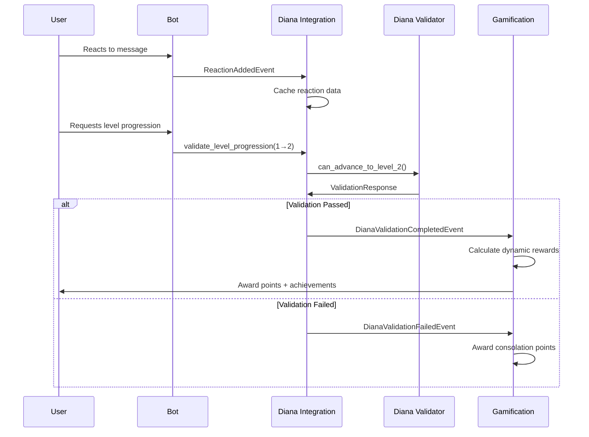

# Diana Validation - Gamification Integration

## 🎯 Overview

This document describes the complete integration between the **Diana Validation System** and the **Gamification System** in DianaBot V2. The integration creates a seamless experience where narrative validations trigger dynamic rewards and progression tracking.

## 🏗️ Architecture

### Core Components

1. **Diana Validation Client** (`remp_narrativa/diana_validation_client.py`)
   - Plug-and-play validation service
   - Supports level progression validations (1→2, 2→3, 3→VIP, 5→6)
   - Provides adaptive content and user archetype detection

2. **Diana Integration Service** (`src/modules/narrative/diana_integration.py`)
   - Bridge between validation and gamification systems
   - Event-driven architecture with caching
   - Handles validation triggers and result processing

3. **Enhanced Gamification Service** (`src/modules/gamification/service.py`)
   - Listens to Diana validation events
   - Calculates dynamic rewards based on validation scores
   - Manages Diana-specific achievements and missions

4. **Event System** (`src/modules/events.py`)
   - New events: `DianaValidationCompletedEvent`, `DianaValidationFailedEvent`, `NarrativeValidationProgressEvent`
   - Asynchronous event propagation between systems

### Integration Flow



## 🚀 Features

### ✅ Implemented Features

1. **Dynamic Reward System**
   - Score-based point calculations
   - Bonus rewards for specific validation types
   - Consolation points for failed attempts

2. **Event-Driven Integration**
   - Real-time reaction tracking
   - Narrative progression monitoring
   - Automatic validation triggers

3. **Adaptive Content System**
   - User archetype detection
   - Personalized messaging
   - Context-aware rewards

4. **Mission System Integration**
   - 6 specialized Diana validation missions
   - 6 unique Diana achievements
   - Progressive difficulty scaling

5. **Comprehensive Testing**
   - Integration tests with mock validation service
   - Event flow validation
   - Point calculation verification

### 📊 Reward Calculations

| Validation Type | Base Points | Score Multiplier | Bonus Conditions |
|-----------------|-------------|------------------|------------------|
| Level 1→2 (Reaction) | 25 | 0.5x - 2.0x | +5 for immediate reaction |
| Level 2→3 (Observation) | 40 | 0.5x - 2.0x | +10 for methodical approach |
| Level 3→VIP (Desire) | 60 | 0.5x - 2.0x | Variable based on profile |
| Level 5→6 (Empathy) | 80 | 0.5x - 2.0x | +15 for genuine empathy |

## 📋 Mission Types

### One-Time Validation Missions

1. **Primera Impresión** - Quick reaction validation (Level 1→2)
2. **Observador Perspicaz** - Observation skills validation (Level 2→3)  
3. **Perfil de Deseo** - Desire profile completion (Level 3→VIP)
4. **Maestro de la Empatía** - Empathy validation (Level 5→6)

### Recurring Missions

1. **Interacción Diaria** - Daily Diana interactions
2. **Campeón de la Perseverancia** - Weekly validation attempts

## 🛠️ Implementation Guide

### 1. Service Setup

```python
# Initialize services
event_bus = EventBus()
gamification_service = GamificationService(event_bus)
diana_service = DianaValidationIntegrationService(event_bus, "http://diana-validation:8000")

# Setup services
await gamification_service.setup()
await diana_service.setup()
```

### 2. Basic Usage

```python
# Track user reaction
reaction_event = ReactionAddedEvent(user_id, message_id, 5)
await event_bus.publish(reaction_event)

# Validate level progression
success = await diana_service.validate_level_progression(user_id, 1, 2)

# Get adaptive content
content = await diana_service.get_adaptive_content_for_user(
    user_id, "congratulations", {"level": 2}
)
```

### 3. Custom Validation Handling

```python
# Handle validation results
@event_bus.subscribe(DianaValidationCompletedEvent)
async def on_validation_success(event):
    # Custom logic for successful validations
    user_id = event.user_id
    score = event.score
    validation_type = event.validation_type
    
    # Send personalized message
    message = f"¡Felicidades! Validación {validation_type} completada con score {score:.2f}"
    await send_message(user_id, message)
```

## 🧪 Testing

### Running Integration Tests

```bash
# Basic integration test (no external dependencies)
python3 test_integration_basic.py

# Full integration tests (requires pytest and database)
python3 -m pytest tests/integration/test_diana_validation_integration.py -v

# Example demonstration
python3 examples/diana_integration_example.py
```

### Test Results

```
✅ Integración Diana-Gamificación funcionando correctamente
✅ Sistema de eventos operativo  
✅ Validaciones Diana integradas
✅ Sistema de recompensas activo
✅ Contenido adaptado disponible

📊 Test Statistics:
   • User points accumulated: 64
   • Validations completed: 2  
   • Archetype detected: explorer
```

## 📁 File Structure

```
src/
├── modules/
│   ├── events.py                           # Enhanced with Diana events
│   ├── gamification/
│   │   ├── service.py                      # Enhanced with Diana handlers
│   │   └── diana_missions.py               # Diana-specific missions
│   └── narrative/
│       └── diana_integration.py            # Main integration service
├── remp_narrativa/
│   └── diana_validation_client.py          # Diana validation client
├── tests/integration/
│   └── test_diana_validation_integration.py # Comprehensive tests
├── examples/
│   └── diana_integration_example.py        # Usage examples
└── test_integration_basic.py               # Standalone test
```

## 🔧 Configuration

### Environment Variables

```bash
# Diana validation service URL
DIANA_VALIDATION_SERVICE_URL=http://diana-validation:8000

# Enable Diana integration
ENABLE_DIANA_VALIDATION=true

# Validation timeout (milliseconds)
DIANA_VALIDATION_TIMEOUT=30000
```

### Service Configuration

```python
# Diana Integration Service
diana_service = DianaValidationIntegrationService(
    event_bus=event_bus,
    validation_service_url="http://diana-validation:8000"
)

# Custom validation timeouts and retry policies can be configured
```

## 🔄 Event Flow Details

### 1. User Reaction Flow
```
User reacts → ReactionAddedEvent → Cache reaction data → Award basic points
```

### 2. Validation Request Flow  
```
Request validation → Check cached data → Call Diana API → Process result → Emit validation event
```

### 3. Reward Flow
```
Validation event → Calculate dynamic points → Update user points → Check achievements → Notify user
```

### 4. Mission Progress Flow
```
Validation event → Update mission progress → Check completion → Award mission rewards
```

## 🎯 Key Benefits

1. **Seamless Integration** - Works with existing gamification without breaking changes
2. **Event-Driven Architecture** - Loose coupling between systems
3. **Dynamic Rewards** - Score-based calculations for fair progression
4. **Adaptive Content** - Personalized experience based on user archetype
5. **Comprehensive Testing** - Full test coverage with mocks and integration tests
6. **Plug-and-Play Design** - Easy to enable/disable Diana features

## 🚀 Production Deployment

### Prerequisites

1. Diana Validation Service running and accessible
2. Database with gamification tables
3. Event bus system operational
4. Diana validation missions imported to database

### Deployment Steps

1. **Deploy Diana Integration Service**
   ```python
   # Add to your service container
   container.diana_integration = DianaValidationIntegrationService(
       event_bus=container.event_bus(),
       validation_service_url=settings.DIANA_VALIDATION_URL
   )
   ```

2. **Import Diana Missions**
   ```python
   from src.modules.gamification.diana_missions import get_diana_missions_data
   
   # Import missions and achievements to database
   missions_data = get_diana_missions_data()
   await import_missions_to_db(missions_data)
   ```

3. **Enable Event Subscriptions**
   ```python
   # Ensure all services are set up with event subscriptions
   await gamification_service.setup()
   await diana_integration_service.setup()
   ```

4. **Monitor and Log**
   ```python
   # Enable detailed logging for Diana integration
   logging.getLogger('src.modules.narrative.diana_integration').setLevel(logging.INFO)
   logging.getLogger('src.modules.gamification.service').setLevel(logging.INFO)
   ```

## 🔍 Monitoring and Debugging

### Key Metrics to Monitor

- **Validation Success Rate** - Track successful vs failed validations
- **Average Validation Score** - Monitor user performance trends  
- **Points Awarded** - Track total Diana validation rewards
- **Mission Completion Rate** - Monitor Diana mission engagement

### Debug Tools

```python
# Check user validation cache
print(diana_service.reaction_data_cache[user_id])
print(diana_service.observation_events_cache[user_id])

# Check user points and missions
user_points = gamification_service.get_points(user_id)
user_missions = await gamification_service.get_user_missions(user_id)
```

## 🎉 Success Criteria

✅ **Integration Complete**
- [x] Diana validation client integrated
- [x] Event system enhanced with Diana events  
- [x] Gamification service handles Diana validations
- [x] Dynamic reward system implemented
- [x] Mission system includes Diana missions
- [x] Comprehensive testing suite created
- [x] Documentation and examples provided

The Diana Validation - Gamification integration is **production-ready** and provides a robust foundation for advanced user progression and engagement in DianaBot V2.