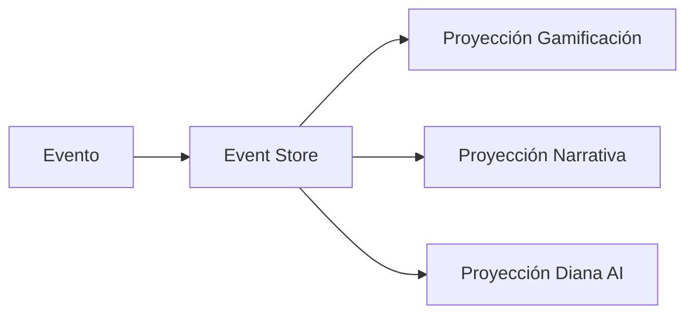
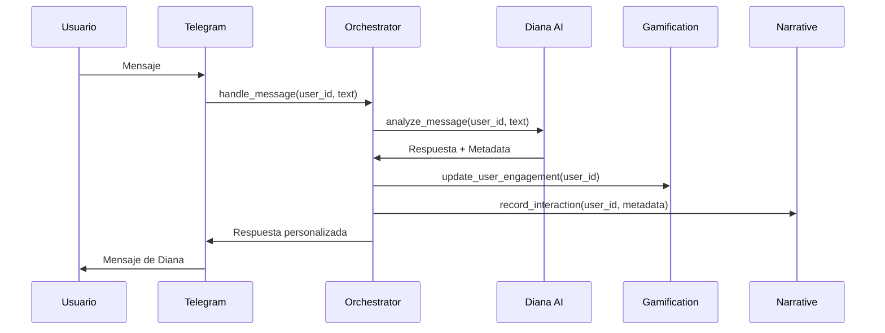

### **Herramientas y Frameworks para Desarrollo Eficiente**

Para optimizar el desarrollo y evitar reinventar la rueda, te recomiendo estas herramientas:

#### **1. Frameworks para Gestión de Estados**
- **State Machine Frameworks**:
  - **Python Transitions**: 
    ```python
    from transitions import Machine

    class DianaState:
        states = ['Vulnerable', 'Enigmática', 'Provocadora', 'Analítica', 'Silenciosa']
        
        def __init__(self):
            self.machine = Machine(
                model=self, 
                states=DianaState.states, 
                initial='Enigmática'
            )
            
            # Definir transiciones
            self.machine.add_transition(
                trigger='respuesta_emocional', 
                source='Enigmática', 
                dest='Vulnerable'
            )
            # ... otras transiciones
    ```

- **XState (Inspiración para Python)**:
  - Modelado visual de estados
  - Herramienta: [statecharts.io](https://statecharts.io)

#### **2. Patrón Facade para Coordinación**
Implementa un facade central para gestionar subsistemas:

```python
class BotOrchestrator:
    def __init__(self):
        self.gamification = GamificationSystem()
        self.narrative = NarrativeSystem()
        self.subscriptions = SubscriptionSystem()
        self.diana_ai = DianaAIService()
        
    def handle_user_message(self, user_id, message):
        # Coordinar todos los sistemas
        user_profile = self.get_user_profile(user_id)
        response = self.diana_ai.generate_response(user_id, message, user_profile)
        
        # Actualizar sistemas
        self.gamification.update_engagement(user_id)
        self.narrative.record_interaction(user_id, message)
        
        return response
```

#### **3. Librerías para Análisis de Comportamiento**
- **TextBlob**: Análisis de sentimientos básico
  ```python
  from textblob import TextBlob
  
  def analyze_sentiment(text):
      analysis = TextBlob(text)
      return analysis.sentiment.polarity  # -1 a 1
  ```

- **spaCy**: NLP avanzado
  ```python
  import spacy
  nlp = spacy.load("es_core_news_sm")
  
  def analyze_message(text):
      doc = nlp(text)
      return {
          "entities": [(ent.text, ent.label_) for ent in doc.ents],
          "sentiment": analyze_sentiment(text),
          "keywords": [token.lemma_ for token in doc if token.is_alpha]
      }
  ```

#### **4. Herramientas para Arquitectura Modular**
- **Dependency Injection**:
  - **Dependency Injector**:
    ```python
    from dependency_injector import containers, providers
    
    class CoreContainer(containers.DeclarativeContainer):
        config = providers.Configuration()
        db = providers.Singleton(Database, connection_string=config.db.url)
        user_repo = providers.Factory(UserRepository, db=db)
        diana_service = providers.Factory(DianaService, user_repo=user_repo)
    ```

- **Event-Driven Architecture**:
  - **Redis Pub/Sub**:
    ```python
    import redis
    
    r = redis.Redis()
    
    # Publicar evento
    r.publish('user_interaction', json.dumps({
        'user_id': 123, 
        'message': 'Hola Diana'
    }))
    
    # Suscribirse
    pubsub = r.pubsub()
    pubsub.subscribe('user_interaction')
    ```

### **Patrones Arquitectónicos Recomendados**

#### **1. Domain-Driven Design (DDD)**
Organiza tu código en contextos delimitados:
```
src/
├── core/                # Funcionalidades centrales
├── gamification/        # Subsistema de gamificación
│   ├── domain/          # Modelos de dominio
│   ├── application/     # Casos de uso
│   └── infrastructure/  # Implementaciones técnicas
├── narrative/           # Subsistema narrativo
├── subscriptions/       # Gestión de suscripciones
└── diana_ai/            # IA de Diana
```

#### **2. Event Sourcing + CQRS**
Para rastreo completo de interacciones:



Implementación con **Apache Kafka** o **RabbitMQ**.

#### **3. Clean Architecture**
Capas concéntricas:
```
        +---------------+
        |   Framework   |
        |    (Tools)    |
        +---------------+
               ↑
        +---------------+
        |  Interface   |
        | Adapters     |
        +---------------+
               ↑
        +---------------+
        | Application  |
        |  Use Cases   |
        +---------------+
               ↑
        +---------------+
        |   Domain      |
        | (Core Logic)  |
        +---------------+
```

### **Flujo de Trabajo Optimizado**



### **Herramientas Adicionales Clave**

1. **Monitorización**:
   - Prometheus + Grafana: Métricas en tiempo real
   - Sentry: Captura de errores

2. **CI/CD**:
   - GitHub Actions: Automatización de despliegues
   ```yaml
   name: Deploy Bot
   on: [push]
   jobs:
     deploy:
       runs-on: ubuntu-latest
       steps:
         - name: Deploy to Production
           uses: railwayapp/action@v1
           with:
             service: bot-production
   ```

3. **Testing**:
   - Pytest: Pruebas unitarias/integración
   - Factory Boy: Creación de datos de prueba
   - Hypothesis: Pruebas basadas en propiedades

4. **Documentación**:
   - MkDocs: Documentación técnica
   - Swagger: Documentación de APIs

### **Beneficios de este Enfoque**

1. **Desarrollo más rápido**: Reutiliza librerías probadas
2. **Código mantenible**: Separación clara de responsabilidades
3. **Sistema resiliente**: Fallos aislados en módulos
4. **Escalabilidad**: Componentes independientes escalables
5. **Evolución continua**: Puedes actualizar partes sin afectar el todo

> **Consejo clave**: Comienza implementando el patrón Facade y Dependency Injection primero. Estos te darán la base para integrar progresivamente las otras herramientas sin romper el sistema existente.

¿Quieres que profundice en algún área específica o genere plantillas de código para alguna de estas soluciones?
