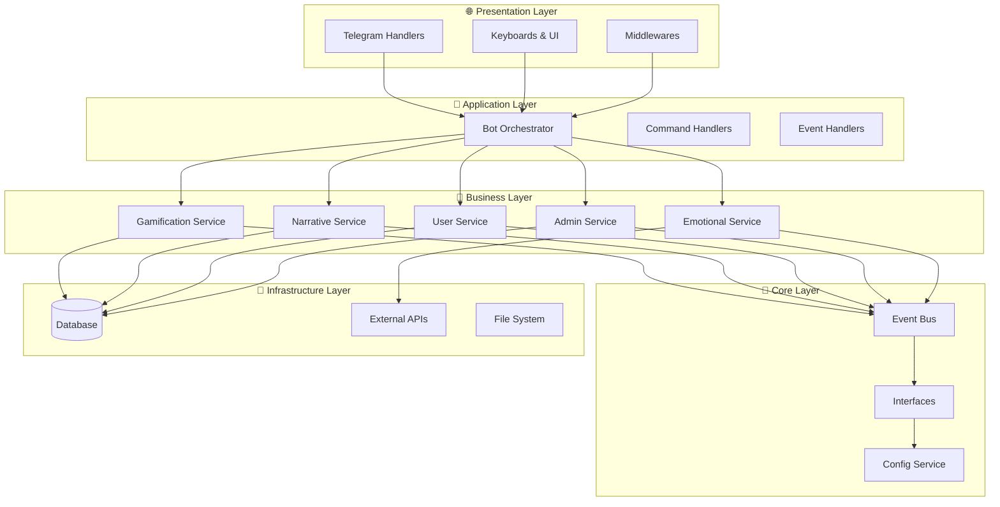
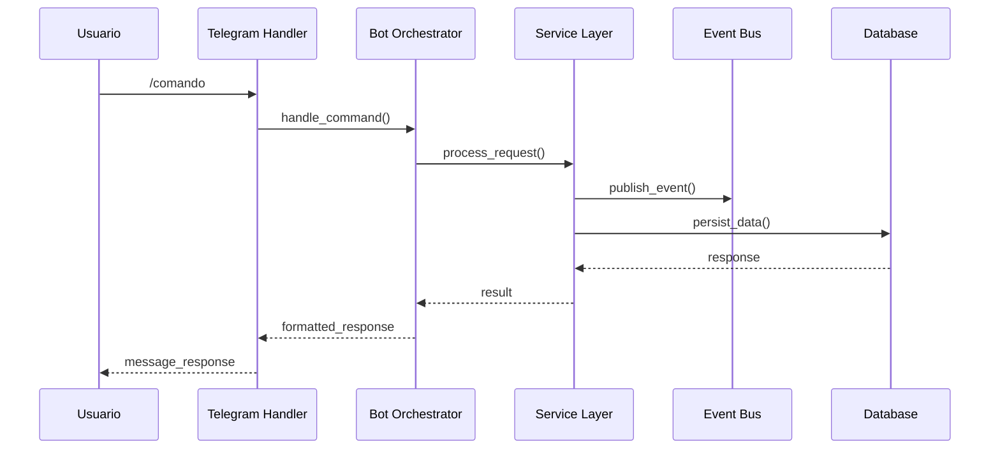
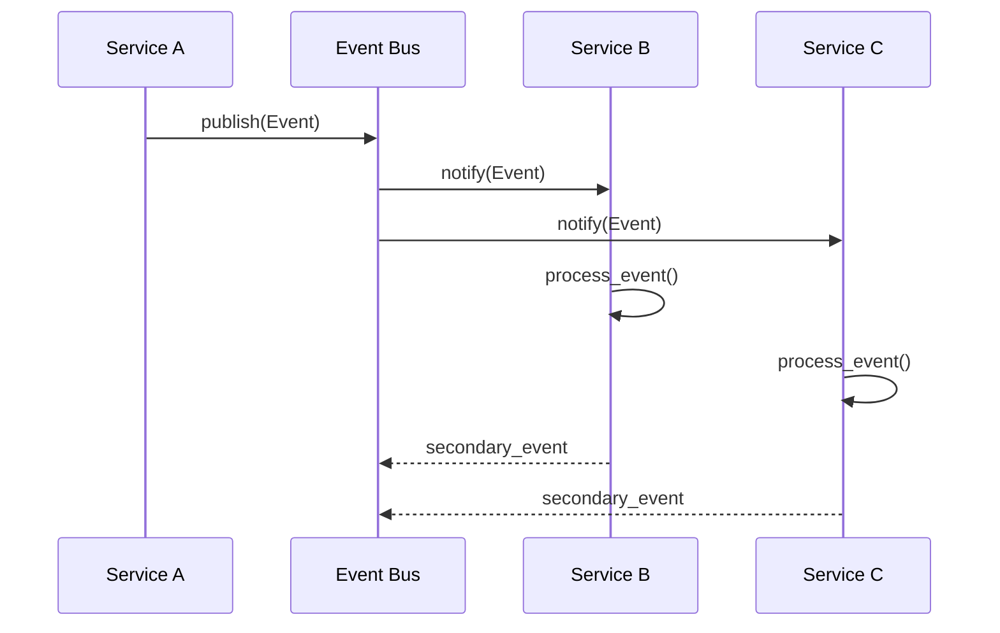

# 🏗️ Arquitectura del Sistema - Visión General

## 🎯 Principios Fundamentales

Diana Bot V2 está construido siguiendo principios de **Clean Architecture** y patrones modernos de desarrollo:

### 1. Arquitectura Limpia (Clean Architecture)
- **Separación de responsabilidades** en capas concéntricas
- **Dependencias hacia el interior** - Las reglas de negocio no conocen detalles de implementación
- **Independencia de frameworks** - La lógica central no depende de Telegram o bases de datos específicas
- **Testabilidad** - Cada componente puede probarse de forma aislada

### 2. Event-Driven Architecture
- **Bus de eventos centralizado** para comunicación asíncrona entre módulos
- **Desacoplamiento** - Los módulos no se conocen directamente entre sí
- **Escalabilidad** - Fácil adición de nuevos suscriptores a eventos
- **Trazabilidad** - Todos los eventos son rastreables y auditables

### 3. Dependency Injection
- **Inversión de control** - Las dependencias se inyectan, no se crean
- **Flexibilidad** - Fácil intercambio de implementaciones
- **Testing** - Inyección de mocks para pruebas
- **Configuración centralizada** - Un solo punto de configuración de dependencias

## 🏗️ Estructura de Capas



## 📁 Estructura de Directorios

```
V2/
├── 📄 pyproject.toml              # Configuración del proyecto
├── 📄 main.py                     # Punto de entrada
├── 🗂️ src/
│   ├── 🗂️ core/                   # 🔄 Núcleo del sistema
│   │   ├── event_bus.py           # Bus de eventos central
│   │   ├── interfaces/            # Contratos e interfaces
│   │   └── services/              # Servicios base
│   ├── 🗂️ modules/                # 💼 Módulos de negocio
│   │   ├── gamification/          # Sistema de gamificación  
│   │   ├── narrative/             # Sistema narrativo
│   │   ├── admin/                 # Panel administrativo
│   │   ├── user/                  # Gestión de usuarios
│   │   └── emotional/             # Sistema emocional
│   ├── 🗂️ infrastructure/         # 💾 Implementaciones externas
│   │   ├── database/              # Acceso a datos  
│   │   └── telegram/              # API de Telegram
│   └── 🗂️ bot/                    # 🌐 Capa de presentación
│       ├── core/                  # Orchestrador y contenedores
│       ├── handlers/              # Manejadores de comandos
│       ├── keyboards/             # Interfaces de usuario
│       └── middlewares/           # Middlewares de Telegram
└── 🗂️ tests/                      # 🧪 Pruebas
    ├── unit/                      # Pruebas unitarias
    └── integration/               # Pruebas de integración
```

## 🔄 Flujo de Datos

### 1. Flujo de Comando de Usuario


### 2. Flujo de Eventos Internos


## 🎯 Patrones de Diseño Implementados

### 1. Facade Pattern
**Bot Orchestrator** actúa como facade coordinando múltiples servicios:
```python
class BotOrchestrator:
    def __init__(self, container):
        self._gamification = container.services.gamification_service()
        self._narrative = container.services.narrative_service() 
        self._user = container.services.user_service()
        # ... otros servicios
    
    async def handle_user_message(self, user_id, message):
        # Coordina todos los servicios para procesar el mensaje
        user_profile = await self._user.get_or_create_user(user_id)
        await self._gamification.update_engagement(user_id)
        await self._narrative.record_interaction(user_id, message)
        # ... más coordinación
```

### 2. Observer Pattern (Event Bus)
Los servicios se suscriben a eventos sin conocerse entre sí:
```python
# Servicio publica evento
await event_bus.publish(UserActionEvent(user_id=123, action="trivia_completed"))

# Otros servicios reaccionan automáticamente
gamification_service.on_user_action()  # Otorga puntos
narrative_service.on_user_action()     # Puede desbloquear contenido
admin_service.on_user_action()         # Registra estadística
```

### 3. Dependency Injection Container
Gestión centralizada de dependencias:
```python
class ApplicationContainer(DeclarativeContainer):
    # Core services
    event_bus = providers.Singleton(EventBus)
    config = providers.Singleton(CentralConfig)
    
    # Business services  
    gamification_service = providers.Factory(
        GamificationService,
        event_bus=event_bus
    )
    narrative_service = providers.Factory(
        NarrativeService, 
        event_bus=event_bus
    )
```

### 4. Repository Pattern
Abstracción del acceso a datos:
```python
class UserRepository(ABC):
    @abstractmethod
    async def get_user(self, user_id: int) -> Optional[User]:
        pass
    
    @abstractmethod  
    async def create_user(self, user_data: dict) -> User:
        pass

class SQLAlchemyUserRepository(UserRepository):
    # Implementación específica para SQLAlchemy
    pass
```

## 🔐 Principios de Seguridad

### 1. Separación de Roles
- **Usuarios** - Acceso limitado a funcionalidades básicas
- **VIP** - Funcionalidades premium
- **Administradores** - Control total del sistema

### 2. Validación de Entrada
- Todos los inputs de usuario son validados con **Pydantic**
- Sanitización automática de datos
- Prevención de inyección SQL a través de ORM

### 3. Rate Limiting
- Middleware de throttling para prevenir spam
- Límites específicos por tipo de usuario
- Logging de intentos sospechosos

## 📊 Métricas y Monitoreo

### 1. Logging Estructurado
- **Sexy Logger** para logs visuales y estructurados
- Niveles apropiados (DEBUG, INFO, WARNING, ERROR)
- Contexto enriquecido con metadatos

### 2. Métricas de Negocio
- Engagement de usuarios
- Progreso narrativo
- Efectividad de gamificación  
- Performance de sistemas

### 3. Health Checks
- Estado de servicios
- Conectividad de base de datos
- Latencia de APIs externas

## 🚀 Escalabilidad

### 1. Horizontal Scaling
- **Event Bus** permite múltiples instancias
- **Stateless services** facilitan load balancing
- **Database connection pooling**

### 2. Vertical Scaling
- **Async/await** para operaciones I/O
- **Connection pooling** para bases de datos
- **Caching** estratégico de datos frecuentes

### 3. Microservices Ready
- Cada módulo puede convertirse en microservicio independiente
- Event Bus puede migrar a sistemas distribuidos (Redis, Kafka)
- APIs REST/GraphQL pueden añadirse fácilmente

## ⚡ Performance

### 1. Optimizaciones Implementadas
- **Lazy loading** de servicios pesados
- **Batch processing** de eventos relacionados
- **Database indexing** en campos críticos
- **Connection pooling** para reducir overhead

### 2. Caching Strategy
- **In-memory caching** para datos de sesión
- **Database query caching** para consultas frecuentes
- **User state caching** para reducir DB hits

## 🔄 Próximos Pasos Arquitectónicos

1. **Message Queue Integration** - Para high-throughput scenarios
2. **API Gateway** - Para exposición externa de funcionalidades  
3. **Microservices Migration** - Separación física de módulos
4. **Real-time Analytics** - Dashboard en tiempo real
5. **Multi-tenancy** - Soporte para múltiples instancias

---

Esta arquitectura proporciona una base sólida, escalable y mantenible para Diana Bot V2, permitiendo evolución continua sin comprometer la estabilidad del sistema.