# 🔄 Event Bus - Sistema de Eventos Centralizado

## 🎯 Concepto y Propósito

El **Event Bus** es el núcleo de comunicación de Diana Bot V2. Implementa el patrón **Observer** para permitir comunicación asíncrona y desacoplada entre módulos del sistema.

### Ventajas del Event Bus
- **🔗 Desacoplamiento**: Los módulos no se conocen directamente
- **📈 Escalabilidad**: Fácil adición de nuevos suscriptores
- **🔍 Trazabilidad**: Todos los eventos son rastreables
- **🧪 Testabilidad**: Fácil mockeo de eventos para pruebas
- **⚡ Performance**: Procesamiento asíncrono de eventos

## 🏗️ Arquitectura del Event Bus

```mermaid
graph TB
    subgraph "📤 Event Publishers"
        US[User Service]
        GS[Gamification Service] 
        NS[Narrative Service]
        AS[Admin Service]
        ES[Emotional Service]
    end
    
    subgraph "🔄 Event Bus"
        EB[Event Bus Core]
        EQ[Event Queue]
        EH[Event Handlers]
    end
    
    subgraph "📥 Event Subscribers"
        S1[Subscriber 1]
        S2[Subscriber 2]  
        S3[Subscriber 3]
        SN[Subscriber N]
    end
    
    US --> EB
    GS --> EB
    NS --> EB
    AS --> EB
    ES --> EB
    
    EB --> EQ
    EQ --> EH
    
    EH --> S1
    EH --> S2
    EH --> S3
    EH --> SN
```



## 🔧 Implementación Técnica

### Interface Base
```python
from abc import ABC, abstractmethod
from typing import Any, Dict
from datetime import datetime

class IEvent(ABC):
    """Interface base para todos los eventos."""
    
    def __init__(self):
        self.timestamp = datetime.now().isoformat()
        self.event_id = str(uuid.uuid4())
    
    @property
    @abstractmethod
    def event_type(self) -> str:
        """Tipo del evento para identificación."""
        pass
    
    @abstractmethod
    def to_dict(self) -> Dict[str, Any]:
        """Serializa el evento a diccionario."""
        pass

class IEventBus(ABC):
    """Interface del bus de eventos."""
    
    @abstractmethod
    def subscribe(self, event_type: Type[IEvent], handler: Callable) -> None:
        """Suscribe un handler a un tipo de evento."""
        pass
    
    @abstractmethod
    async def publish(self, event: IEvent) -> None:
        """Publica un evento a todos los suscriptores."""
        pass
```

### Implementación Concreta
```python
import asyncio
from collections import defaultdict
from typing import Callable, List, Type, Dict

class EventBus(IEventBus):
    """Implementación concreta del bus de eventos."""

    def __init__(self):
        self._subscribers: Dict[Type[IEvent], List[Callable]] = defaultdict(list)
        self._middleware: List[Callable] = []
        self._event_history: List[IEvent] = []
        
    def subscribe(self, event_type: Type[IEvent], handler: Callable) -> None:
        """Suscribe un manejador a un evento."""
        self._subscribers[event_type].append(handler)
        logger.debug(f"Handler {handler.__name__} subscribed to {event_type.__name__}")

    async def publish(self, event: IEvent) -> None:
        """Publica un evento, notificando a todos los suscriptores."""
        logger.debug(f"Publishing event: {event.event_type}")
        
        # Aplicar middleware pre-procesamiento
        for middleware in self._middleware:
            event = await middleware(event)
        
        # Almacenar en historial  
        self._event_history.append(event)
        
        # Obtener suscriptores para este tipo de evento
        event_type = type(event)
        if event_type in self._subscribers:
            # Ejecutar todos los handlers concurrentemente
            tasks = [
                self._safe_handler_execution(handler, event) 
                for handler in self._subscribers[event_type]
            ]
            await asyncio.gather(*tasks, return_exceptions=True)
    
    async def _safe_handler_execution(self, handler: Callable, event: IEvent) -> None:
        """Ejecuta un handler de forma segura capturando excepciones."""
        try:
            await handler(event)
        except Exception as e:
            logger.error(f"Error in event handler {handler.__name__}: {str(e)}")
            # Opcionalmente, publicar evento de error
            await self.publish(ErrorEvent(
                original_event=event,
                error_message=str(e),
                handler_name=handler.__name__
            ))
```

## 📋 Tipos de Eventos Implementados

### 1. Eventos de Usuario
```python
@dataclass
class UserStartedBotEvent(IEvent):
    """Usuario inició el bot por primera vez."""
    user_id: int
    username: str
    timestamp: str
    
    @property
    def event_type(self) -> str:
        return "user.started_bot"

@dataclass  
class UserMessageEvent(IEvent):
    """Usuario envió un mensaje."""
    user_id: int
    message: str
    timestamp: str
    
    @property
    def event_type(self) -> str:
        return "user.message_sent"

@dataclass
class UserLevelUpEvent(IEvent):
    """Usuario subió de nivel."""
    user_id: int
    old_level: int
    new_level: int
    rewards: List[Dict[str, Any]]
    
    @property
    def event_type(self) -> str:
        return "user.level_up"
```

### 2. Eventos de Gamificación
```python
@dataclass
class PointsAwardedEvent(IEvent):
    """Puntos otorgados a usuario."""
    user_id: int
    points: int
    reason: str
    multiplier: float = 1.0
    
    @property
    def event_type(self) -> str:
        return "gamification.points_awarded"

@dataclass
class MissionCompletedEvent(IEvent):
    """Misión completada por usuario."""
    user_id: int
    mission_id: str
    rewards: List[Dict[str, Any]]
    completion_time: str
    
    @property
    def event_type(self) -> str:
        return "gamification.mission_completed"

@dataclass
class AchievementUnlockedEvent(IEvent):
    """Logro desbloqueado."""
    user_id: int
    achievement_id: str
    achievement_name: str
    description: str
    
    @property
    def event_type(self) -> str:
        return "gamification.achievement_unlocked"
```

### 3. Eventos Narrativos
```python
@dataclass
class NarrativeProgressEvent(IEvent):
    """Progreso en la narrativa."""
    user_id: int
    old_fragment_id: str
    new_fragment_id: str
    choice_made: int
    
    @property
    def event_type(self) -> str:
        return "narrative.progress_made"

@dataclass
class SecretUnlockedEvent(IEvent):
    """Secreto narrativo desbloqueado."""
    user_id: int
    secret_id: str
    trigger_combination: List[str]
    
    @property
    def event_type(self) -> str:
        return "narrative.secret_unlocked"
```

### 4. Eventos de Sistema
```python
@dataclass
class ReactionAddedEvent(IEvent):
    """Reacción añadida a mensaje."""
    user_id: int
    message_id: int
    reaction_type: str
    points_to_award: int
    
    @property
    def event_type(self) -> str:
        return "system.reaction_added"

@dataclass
class CommandExecutedEvent(IEvent):
    """Comando ejecutado por usuario."""
    user_id: int
    command: str
    args: List[str]
    timestamp: str
    
    @property
    def event_type(self) -> str:
        return "system.command_executed"
```

## 🔗 Patrones de Suscripción

### 1. Suscripción Simple
```python
class GamificationService:
    def __init__(self, event_bus: IEventBus):
        self.event_bus = event_bus
        
    async def setup(self):
        """Configurar suscripciones a eventos."""
        self.event_bus.subscribe(UserMessageEvent, self.on_user_message)
        self.event_bus.subscribe(ReactionAddedEvent, self.on_reaction_added)
        
    async def on_user_message(self, event: UserMessageEvent):
        """Maneja mensajes de usuario para gamificación."""
        await self.update_engagement(event.user_id)
        
    async def on_reaction_added(self, event: ReactionAddedEvent):
        """Maneja reacciones para otorgar puntos."""
        await self.award_points(event.user_id, event.points_to_award)
```

### 2. Suscripción Múltiple con Dispatcher
```python
class NarrativeService:
    def __init__(self, event_bus: IEventBus):
        self.event_bus = event_bus
        self._event_handlers = {
            UserStartedBotEvent: self.on_user_started,
            UserMessageEvent: self.on_user_message,
            MissionCompletedEvent: self.on_mission_completed,
        }
        
    async def setup(self):
        """Configurar múltiples suscripciones."""
        for event_type, handler in self._event_handlers.items():
            self.event_bus.subscribe(event_type, handler)
    
    async def on_user_started(self, event: UserStartedBotEvent):
        """Usuario nuevo - enviar primer fragmento."""
        await self.send_initial_fragment(event.user_id)
        
    async def on_mission_completed(self, event: MissionCompletedEvent):
        """Misión completada - posible pista narrativa."""
        if self._should_grant_narrative_reward(event.mission_id):
            await self.grant_narrative_clue(event.user_id)
```

### 3. Suscripción Condicional
```python
class AdminService:
    async def setup(self):
        """Suscribirse solo a eventos administrativos relevantes."""
        
        # Todos los eventos para estadísticas
        for event_type in [UserStartedBotEvent, CommandExecutedEvent, 
                          PointsAwardedEvent, MissionCompletedEvent]:
            self.event_bus.subscribe(event_type, self.record_statistics)
            
        # Eventos específicos para alertas
        self.event_bus.subscribe(ErrorEvent, self.handle_system_error)
        self.event_bus.subscribe(SuspiciousActivityEvent, self.investigate_user)
```

## ⚡ Flujos de Eventos Complejos

### Flujo: Usuario completa Trivia


### Flujo: Reacción en cadena
```python
async def handle_diana_validation_result(self, user_id: int, validation_data: dict):
    """Ejemplo de evento que desencadena múltiples acciones."""
    
    # 1. Publicar evento inicial
    await self.event_bus.publish(DianaValidationEvent(
        user_id=user_id,
        validation_result=validation_data,
        archetype_detected=validation_data.get('archetype'),
        level_progression=validation_data.get('level_change')
    ))
    
    # Los suscriptores reaccionan automáticamente:
    # - GamificationService otorga puntos con multiplicador
    # - NarrativeService puede desbloquear contenido especial  
    # - EmotionalService actualiza estado de Diana
    # - AdminService registra el evento para métricas
```

## 🧪 Testing del Event Bus

### Test Unitario
```python
import pytest
from unittest.mock import AsyncMock
from src.core.event_bus import EventBus
from src.modules.events import UserMessageEvent

@pytest.mark.asyncio
async def test_event_publication():
    """Test básico de publicación de eventos."""
    event_bus = EventBus()
    handler = AsyncMock()
    
    # Suscribir handler
    event_bus.subscribe(UserMessageEvent, handler)
    
    # Publicar evento
    event = UserMessageEvent(user_id=123, message="test", timestamp="2025-08-04T10:00:00")
    await event_bus.publish(event)
    
    # Verificar que el handler fue llamado
    handler.assert_called_once_with(event)

@pytest.mark.asyncio
async def test_multiple_subscribers():
    """Test de múltiples suscriptores al mismo evento."""
    event_bus = EventBus()
    handler1 = AsyncMock()
    handler2 = AsyncMock()
    
    # Suscribir múltiples handlers
    event_bus.subscribe(UserMessageEvent, handler1)
    event_bus.subscribe(UserMessageEvent, handler2)
    
    # Publicar evento
    event = UserMessageEvent(user_id=123, message="test", timestamp="2025-08-04T10:00:00")
    await event_bus.publish(event)
    
    # Verificar que ambos handlers fueron llamados
    handler1.assert_called_once_with(event)
    handler2.assert_called_once_with(event)
```

### Test de Integración
```python
@pytest.mark.asyncio
async def test_gamification_narrative_integration():
    """Test de integración entre sistemas via Event Bus."""
    event_bus = EventBus()
    
    # Setup servicios reales
    gamification = GamificationService(event_bus)
    narrative = NarrativeService(event_bus)
    
    await gamification.setup()
    await narrative.setup()
    
    # Simular completar trivia
    event = TriviaCompletedEvent(
        user_id=123,
        difficulty="medium",
        correct_answers=8,
        total_questions=10
    )
    
    await event_bus.publish(event)
    
    # Verificar efectos en gamificación
    points = await gamification.get_points(123)
    assert points >= 80  # 8 respuestas correctas
    
    # Verificar efectos en narrativa
    user_progress = await narrative.get_user_progress(123)
    assert user_progress.has_new_content  # Puede haber desbloqueado contenido
```

## 📊 Monitoreo y Debugging

### Event Logging
```python
class EventBus(IEventBus):
    async def publish(self, event: IEvent) -> None:
        # Log detallado para debugging
        logger.info(f"📤 Publishing: {event.event_type}", extra={
            'event_id': event.event_id,
            'event_type': event.event_type,
            'timestamp': event.timestamp,
            'payload': event.to_dict()
        })
        
        # Métricas de performance
        start_time = time.time()
        await self._process_event(event)
        duration = time.time() - start_time
        
        logger.debug(f"⚡ Event processed in {duration:.3f}s", extra={
            'event_type': event.event_type,
            'duration_ms': duration * 1000,
            'subscribers_count': len(self._subscribers.get(type(event), []))
        })
```

### Event Inspector (Debug Tool)
```python
class EventInspector:
    """Herramienta para inspeccionar eventos en desarrollo."""
    
    def __init__(self, event_bus: EventBus):
        self.event_bus = event_bus
        self.event_log = []
        
        # Suscribirse a TODOS los eventos
        self.event_bus.add_global_subscriber(self.log_all_events)
    
    async def log_all_events(self, event: IEvent):
        """Log de todos los eventos para debugging."""
        self.event_log.append({
            'timestamp': event.timestamp,
            'type': event.event_type,
            'data': event.to_dict()
        })
        
        if len(self.event_log) > 1000:  # Limitar memoria
            self.event_log = self.event_log[-500:]  # Mantener los últimos 500
    
    def get_events_by_user(self, user_id: int) -> List[Dict]:
        """Obtener todos los eventos de un usuario específico."""
        return [e for e in self.event_log if e['data'].get('user_id') == user_id]
```

## 🚀 Escalabilidad y Performance

### Event Batching
```python
class BatchEventBus(EventBus):
    """Event Bus optimizado para high-throughput."""
    
    def __init__(self, batch_size: int = 100, batch_timeout: float = 1.0):
        super().__init__()
        self.batch_size = batch_size
        self.batch_timeout = batch_timeout
        self.event_queue = asyncio.Queue()
        self.batch_processor_task = None
    
    async def start(self):
        """Iniciar procesamiento por lotes."""
        self.batch_processor_task = asyncio.create_task(self._batch_processor())
    
    async def publish(self, event: IEvent) -> None:
        """Añadir evento a cola para procesamiento por lotes."""
        await self.event_queue.put(event)
    
    async def _batch_processor(self):
        """Procesa eventos en lotes para mejor performance."""
        batch = []
        
        while True:
            try:
                # Recopilar eventos hasta batch_size o timeout
                timeout_task = asyncio.create_task(asyncio.sleep(self.batch_timeout))
                
                while len(batch) < self.batch_size:
                    done, pending = await asyncio.wait([
                        asyncio.create_task(self.event_queue.get()),
                        timeout_task
                    ], return_when=asyncio.FIRST_COMPLETED)
                    
                    if timeout_task in done:
                        break  # Timeout alcanzado
                    else:
                        event = done.pop().result()
                        batch.append(event)
                
                # Procesar lote si hay eventos
                if batch:
                    await self._process_batch(batch)
                    batch.clear()
                    
            except Exception as e:
                logger.error(f"Error in batch processor: {e}")
```

### Persistent Event Store
```python
class PersistentEventBus(EventBus):
    """Event Bus con persistencia para replay y auditoría."""
    
    def __init__(self, db_connection):
        super().__init__()
        self.db = db_connection
    
    async def publish(self, event: IEvent) -> None:
        # Persistir evento antes de procesar
        await self._persist_event(event)
        
        # Procesar normalmente
        await super().publish(event)
    
    async def _persist_event(self, event: IEvent):
        """Guarda evento en base de datos."""
        await self.db.execute("""
            INSERT INTO event_log (event_id, event_type, payload, timestamp)
            VALUES (?, ?, ?, ?)
        """, (event.event_id, event.event_type, 
              json.dumps(event.to_dict()), event.timestamp))
    
    async def replay_events(self, from_timestamp: str, to_timestamp: str):
        """Reproduce eventos de un período específico."""
        events = await self.db.fetch_all("""
            SELECT payload FROM event_log 
            WHERE timestamp BETWEEN ? AND ?
            ORDER BY timestamp
        """, (from_timestamp, to_timestamp))
        
        for event_data in events:
            event = self._deserialize_event(event_data['payload'])
            await super().publish(event)
```

---

El Event Bus es el corazón que mantiene unidos todos los sistemas de Diana Bot V2, proporcionando comunicación eficiente, desacoplada y escalable entre módulos.