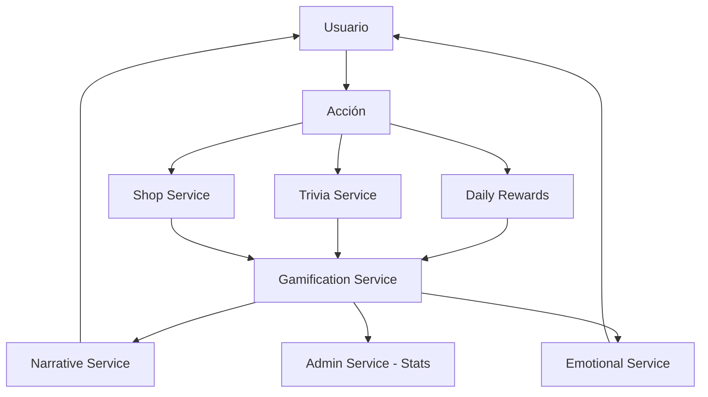

# 💼 Servicios y Módulos - Lógica de Negocio

## 🎯 Arquitectura de Servicios

Los servicios en Diana Bot V2 implementan la lógica de negocio siguiendo el patrón **Domain Service**. Cada módulo de negocio tiene su servicio correspondiente que encapsula las reglas específicas del dominio.

## 📋 Inventario Completo de Servicios

### 🛒 **Shop Service** - Sistema de Tienda
**Ubicación**: `src/modules/shop/service.py`  
**Estado**: ✅ 100% Funcional

#### 🏪 Funcionalidades Implementadas
- **Catálogo Completo**: 12 objetos únicos organizados en 4 categorías
- **Sistema de Compras**: Validación, procesamiento y aplicación de efectos
- **Gestión de Inventario**: Control de stock y disponibilidad
- **Estadísticas**: Métricas de ventas y popularidad

#### 📦 Productos Disponibles
```python
CATEGORIES = {
    "🔮 Místicos": ["Pista Básica", "Pista Premium", "Desbloqueo Fragmento"],
    "💎 Elegantes": ["Puntos Dobles", "Saltar Misión", "Regalo Extra"],
    "🎯 Útiles": ["Acceso VIP Temporal", "Fichas de Subasta"],
    "🌟 Especiales": ["Caja Misteriosa", "Destacar Nombre"]
}
```

#### 🔗 API Principal
```python
# Obtener catálogo filtrado por usuario
shop_items = await shop_service.get_shop_items(user_id, category=None, vip_only=False)

# Procesar compra completa
purchase_result = await shop_service.purchase_item(user_id, item_id)

# Verificar capacidad de compra
can_buy = await shop_service.can_purchase(user_id, item_id)
```

---

### 🎁 **Daily Rewards Service** - Regalos Diarios
**Ubicación**: `src/modules/daily_rewards/service.py`  
**Estado**: ✅ 100% Funcional

#### 🎁 Sistema de Recompensas
- **12 Tipos de Recompensas**: Desde besitos básicos hasta fragmentos narrativos
- **Sistema de Rachas**: Bonificaciones por días consecutivos
- **Probabilidades Dinámicas**: Sistema inteligente basado en rareza
- **Leaderboards**: Rankings de rachas más largas

#### 🔥 Mecánica de Rachas
```python
STREAK_MULTIPLIERS = {
    7: 1.5,   # Semana: +50% besitos
    14: 2.0,  # Dos semanas: +100% besitos
    30: 2.5,  # Mes: +150% besitos
    60: 3.0   # Dos meses: +200% besitos
}
```

#### 🔗 API Principal
```python
# Verificar disponibilidad
can_claim = await daily_rewards_service.can_claim_daily_reward(user_id)

# Reclamar regalo del día
reward_result = await daily_rewards_service.claim_daily_reward(user_id)

# Obtener estadísticas de usuario
stats = await daily_rewards_service.get_user_daily_stats(user_id)
```

---

### 🧠 **Trivia Service** - Sistema de Trivias
**Ubicación**: `src/modules/trivia/service.py`  
**Estado**: ✅ 100% Funcional

#### ❓ Sistema de Preguntas
- **4 Niveles de Dificultad**: Fácil, Medio, Difícil, Experto
- **Múltiples Categorías**: Bot, Geografía, Tecnología, Diana Lore, etc.
- **Preguntas VIP**: Contenido exclusivo para usuarios premium
- **Sistema de Sesiones**: Tracking completo de respuestas

#### 📊 Sistema de Estadísticas
```python
# Métricas por usuario
{
    "total_questions": 145,
    "correct_answers": 123,
    "accuracy": 84.8,
    "current_streak": 12,
    "best_streak": 28,
    "points_earned": 246
}
```

#### 🔗 API Principal
```python
# Pregunta personalizada del día
daily_question = await trivia_service.get_daily_question(user_id)

# Procesar respuesta
result = await trivia_service.submit_answer(user_id, selected_answer)

# Estadísticas completas
stats = await trivia_service.get_user_trivia_stats(user_id)
```

---

### 🎮 **Gamification Service** - Sistema de Gamificación
**Ubicación**: `src/modules/gamification/service.py`  
**Estado**: ✅ 100% Funcional

#### 💰 Sistema de Puntos (Besitos)
- **Economía Completa**: Ganancia y gasto de besitos
- **Múltiples Fuentes**: Trivias, misiones, regalos, reacciones
- **Tracking Detallado**: Historial completo de transacciones

#### 🎯 Sistema de Misiones
```python
MISSION_TYPES = {
    "daily_login": "Iniciar sesión diario",
    "trivia_streak": "Racha en trivias",
    "shop_purchase": "Comprar en tienda",
    "narrative_progress": "Avanzar en historia"
}
```

#### 🏆 Sistema de Logros
- **Logros por Actividad**: Constancia, habilidad, engagement
- **Logros Narrativos**: Progreso en historia de Diana
- **Logros Sociales**: Interacción y participación
- **Verificación Automática**: Sistema event-driven

#### 🔗 API Principal
```python
# Estadísticas completas de puntos
points_data = await gamification_service.get_user_points(user_id)

# Misiones por estado
missions = await gamification_service.get_user_missions(user_id)

# Logros desbloqueados
achievements = await gamification_service.get_user_achievements(user_id)
```

---

### 🛡️ **Admin Service** - Sistema Administrativo
**Ubicación**: `src/modules/admin/service.py`  
**Estado**: ✅ 100% Funcional

#### 🔧 Gestión de Canales
- **Configuración de Canal Gratuito**: Setup y gestión automática
- **Control de Tiempos**: Configuración de cooldowns y esperas
- **Envío Masivo**: Distribución de contenido a canales

#### 💎 Sistema de Tarifas VIP
```python
# CRUD completo de tarifas
{
    "id": "premium_monthly",
    "name": "Premium Mensual",
    "price": 9.99,
    "duration_days": 30,
    "benefits": ["Contenido exclusivo", "Trivias VIP", "Items únicos"]
}
```

#### 🎫 Sistema de Tokens
- **Generación de Tokens**: Tokens únicos por tarifa
- **Validación y Canje**: Proceso completo de activación VIP
- **Gestión de Suscripciones**: Control de expiración y renovación

#### 🔗 API Principal
```python
# Gestión de tarifas
tariffs = await admin_service.get_all_tariffs()
new_tariff = await admin_service.create_tariff(name, price, duration_days)

# Sistema de tokens
token = await admin_service.generate_subscription_token(tariff_id)
validation = await admin_service.validate_token(token, user_id)
```

---

### 📖 **Narrative Service** - Sistema Narrativo
**Ubicación**: `src/modules/narrative/service.py`  
**Estado**: ✅ Funcional con Event-Driven Integration

#### 📜 Sistema de Fragmentos
- **Entrega Automática**: Fragmentos basados en progreso del usuario
- **Estados Narrativos**: Tracking de progreso individual
- **Integración con Gamificación**: Puntos desbloquean contenido

#### 🧩 Sistema de Pistas
- **Desbloqueo por Logros**: Pistas otorgadas por achievements
- **Combinaciones Secretas**: Pistas que se combinan para secretos
- **Integración con Tienda**: Pistas comprables con besitos

#### 🔗 API Principal
```python
# Automático por eventos - Ya integrado
# Los fragmentos se entregan automáticamente basado en progreso
```

---

### 👤 **User Service** - Gestión de Usuarios
**Ubicación**: `src/modules/user/service.py`  
**Estado**: ✅ Funcional Automático

#### 👥 Gestión Automática
- **Registro Automático**: Usuarios creados en primera interacción
- **Tracking de Actividad**: Registro de interacciones y engagement
- **Perfil Unificado**: Datos consolidados de todos los sistemas

---

### 🎭 **Emotional Service** - Sistema Emocional
**Ubicación**: `src/modules/emotional/service.py`  
**Estado**: ✅ Funcional con Diana States

#### 💭 Estados de Diana
```python
DIANA_STATES = {
    "Enigmática": "Misteriosa y reservada",
    "Vulnerable": "Abierta y emocional",
    "Provocadora": "Atrevida y directa", 
    "Analítica": "Lógica y observadora",
    "Silenciosa": "Contemplativa y reflexiva"
}
```

#### 🔄 Transiciones Emocionales
- **Event-Driven**: Estados cambian basado en interacciones
- **Machine Learning Ready**: Preparado para IA avanzada
- **Personalized Responses**: Respuestas basadas en estado actual

---

## 🔄 Interacciones Entre Servicios

### Flujo de Integración Completa


### Ejemplo de Integración: Usuario Completa Trivia
```python
async def handle_trivia_completion(user_id: int, correct_answers: int):
    """Ejemplo de cómo los servicios se integran automáticamente."""
    
    # 1. Trivia Service procesa la respuesta
    result = await trivia_service.submit_answer(user_id, answer)
    
    if result["correct"]:
        # 2. Gamification Service otorga puntos automáticamente (via Event Bus)
        points_awarded = correct_answers * 10
        
        # 3. Narrative Service puede desbloquear contenido (via Event Bus)
        if result["triggers_narrative"]:
            await narrative_service.unlock_fragment(user_id)
        
        # 4. Emotional Service actualiza estado de Diana (via Event Bus)
        await emotional_service.process_achievement(user_id, "trivia_master")
        
        # 5. Admin Service registra estadísticas (via Event Bus)
        await admin_service.record_engagement(user_id, "trivia_completed")
```

## 📊 Estado de Implementación por Módulo

| Servicio | Funcionalidad Core | API Completa | Event Integration | UI Ready |
|----------|-------------------|--------------|-------------------|-----------|
| 🛒 Shop | ✅ 100% | ✅ 100% | ✅ 100% | ✅ Ready |
| 🎁 Daily Rewards | ✅ 100% | ✅ 100% | ✅ 100% | ✅ Ready |
| 🧠 Trivia | ✅ 100% | ✅ 100% | ✅ 100% | ✅ Ready |
| 🎮 Gamification | ✅ 100% | ✅ 100% | ✅ 100% | ✅ Ready |
| 🛡️ Admin | ✅ 100% | ✅ 100% | ✅ 100% | ✅ Ready |
| 📖 Narrative | ✅ 80% | ✅ Event-Driven | ✅ 100% | 🔄 Integrating |
| 👤 User | ✅ 100% | ✅ Automatic | ✅ 100% | ✅ Ready |
| 🎭 Emotional | ✅ 90% | ✅ State-Based | ✅ 100% | 🔄 Integrating |

## 🚀 Próximos Pasos

### Inmediatos (Alta Prioridad)
1. **Conectar servicios 100% listos** al menú épico
2. **Integrar narrative service** con UI completa
3. **Expandir emotional service** con más estados

### Medio Plazo
1. **Optimizar performance** de servicios más utilizados
2. **Implementar caching** para consultas frecuentes
3. **Añadir métricas avanzadas** a todos los servicios

### Largo Plazo
1. **Microservices migration** - Separar servicios físicamente
2. **AI Integration** - Integrar IA en emotional y narrative services
3. **Advanced Analytics** - Dashboard en tiempo real

---

*Todos los servicios están interconectados a través del Event Bus, permitiendo un ecosistema completamente integrado donde cada acción del usuario desencadena múltiples efectos automáticos.*