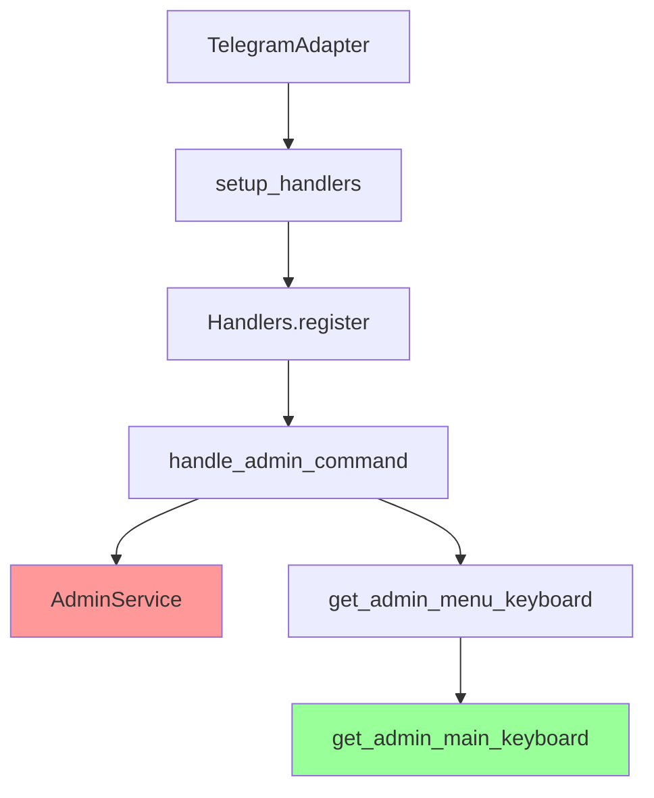
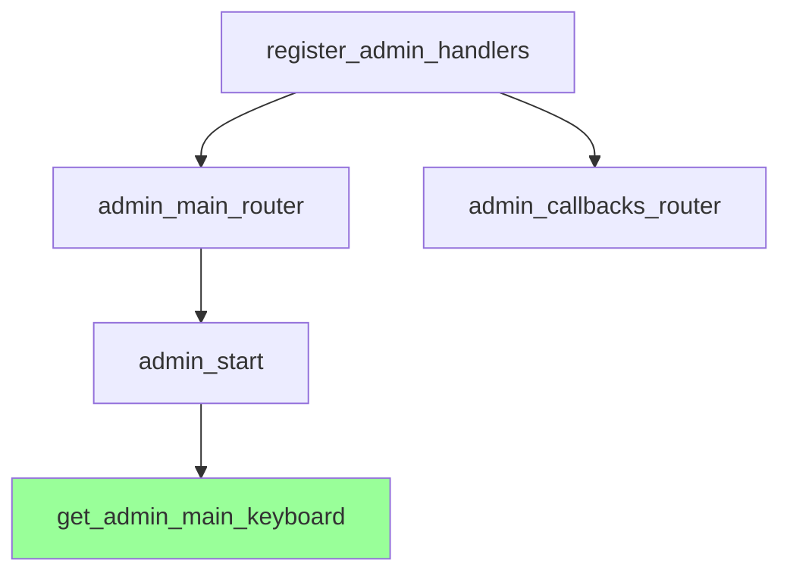
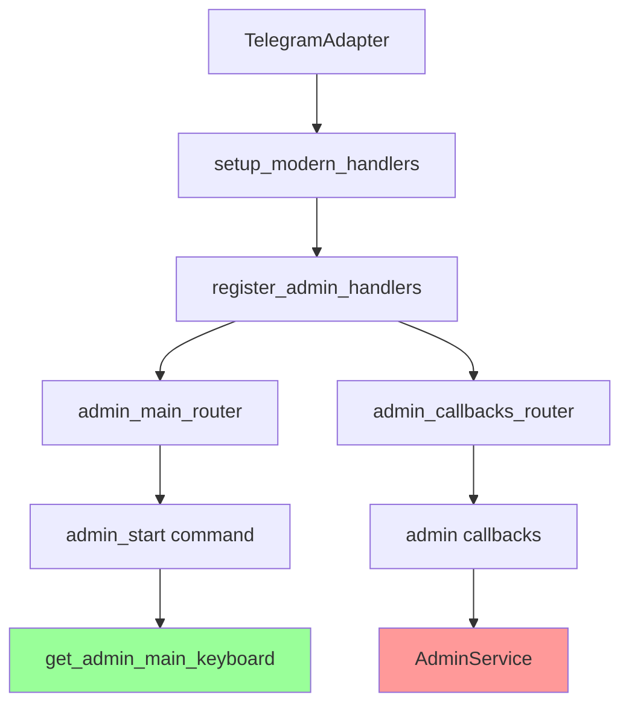

# 🔍 Análisis del Sistema de Menús de Administración - Diana Bot V2

## 🎯 Propósito

Este documento detalla el análisis exhaustivo realizado sobre los sistemas de menú de administración duplicados en Diana Bot V2, identificando conflictos, dependencias y proporcionando una estrategia de consolidación.

## 📅 Información del Análisis

- **Fecha de Análisis**: 2025-08-04
- **Analista**: Claude Code AI
- **Tipo de Análisis**: Revisión exhaustiva de arquitectura
- **Estado**: ✅ Completado - Listo para implementación

---

## 🚨 **PROBLEMA IDENTIFICADO**

El sistema actual tiene **5 implementaciones superpuestas** del menú de administración, causando:

- **Conflictos de comandos**: `/admin` registrado múltiples veces
- **Callbacks duplicados**: Mismos callback_data en diferentes sistemas
- **Interceptación impredecible**: El último sistema registrado intercepta comandos
- **Confusión en desarrollo**: Desarrolladores no saben qué sistema usar
- **Mantenimiento complejo**: Cambios requieren actualizar múltiples lugares

---

## 📋 **INVENTARIO COMPLETO DE SISTEMAS**

### 🔴 **SISTEMA 1: Legacy Infrastructure (ACTIVO EN PRODUCCIÓN)**

**Ubicación**: `src/infrastructure/telegram/`

#### **Componentes Principales:**
- **Handler Principal**: `handlers.py:50` - `handle_admin_command()`
  ```python
  async def handle_admin_command(self, message: types.Message):
      """Handler para el comando /admin - TEMPORAL."""
  ```

- **Teclados Legacy**: `keyboards.py:16` - `get_admin_menu_keyboard()`
  ```python
  def get_admin_menu_keyboard() -> types.InlineKeyboardMarkup:
      """Genera el teclado del menú principal de administración."""
  ```

#### **Funcionalidades Implementadas:**
- ✅ Comando `/admin` funcional
- ✅ Gestión de canales gratuitos y VIP
- ✅ Creación y gestión de tarifas
- ✅ Generación de tokens de suscripción
- ✅ Configuración de tiempos de espera

#### **Callbacks Registrados:**
```python
dp.callback_query.register(self.handle_free_channel_menu_callback, F.data == "admin:free_channel_menu")
dp.callback_query.register(self.handle_vip_channel_menu_callback, F.data == "admin:vip_channel_menu")
# ... +15 callbacks más
```

#### **Estado Actual**: **🟢 PRODUCCIÓN ACTIVA** - Sistema en uso

---

### 🟡 **SISTEMA 2: Modern Bot Handlers (EN MIGRACIÓN)**

**Ubicación**: `src/bot/handlers/admin/`

#### **Componentes Principales:**
- **Handler Principal**: `main.py:11` - `admin_start()`
  ```python
  @admin_main_router.message(Command("admin"))
  async def admin_start(message: Message):
      """Handler para el comando /admin."""
  ```

- **Callbacks Extendidos**: `callbacks.py` - 10+ funciones especializadas
- **Registro Centralizado**: `__init__.py:9` - `register_admin_handlers()`

#### **Funcionalidades Implementadas:**
- ✅ Comando `/admin` moderno
- ✅ Sistema de callbacks organizados por categoría
- ✅ Estadísticas detalladas (usuarios, conversiones, narrativa, gamificación)
- ✅ Configuración avanzada (mensajes automáticos, timeouts, canales)
- ✅ Gestión de roles

#### **Arquitectura Moderna:**
```python
# Separación clara de responsabilidades
admin_main_router = Router()  # Router principal
admin_callbacks_router = Router()  # Router de callbacks

# Registro organizado
def register_admin_handlers(dp, admin_service):
    dp.include_router(admin_main_router)
    dp.include_router(admin_callbacks_router)
```

#### **Estado Actual**: **🟡 MIGRACIÓN PARCIAL** - Algunos callbacks activos

---

### 🟢 **SISTEMA 3: Modern Admin Keyboards (COMPARTIDO)**

**Ubicación**: `src/bot/keyboards/admin/main_kb.py`

#### **Componentes Principales:**
- `get_admin_main_keyboard()` - Línea 3
- `get_admin_stats_keyboard()` - Línea 14  
- `get_admin_settings_keyboard()` - Línea 26
- `get_admin_roles_keyboard()` - Línea 38

#### **Características:**
```python
def get_admin_main_keyboard() -> InlineKeyboardMarkup:
    """Devuelve el teclado principal del panel de administración."""
    buttons = [
        [InlineKeyboardButton(text="🏷️ Gestionar Tarifas", callback_data="admin:tariffs")],
        [InlineKeyboardButton(text="🎟️ Generar Tokens", callback_data="admin:tokens")],
        # ...
    ]
```

#### **Estado Actual**: **🟢 ESTABLE** - Usado por sistemas 1 y 2

---

### 🔵 **SISTEMA 4: Keyboard Factory (NO UTILIZADO)**

**Ubicación**: `src/bot/keyboards/keyboard_factory.py:142`

#### **Métodos Identificados:**
- `admin_menu()` - Línea 142
- `free_channel_admin()` - Línea 151
- `vip_admin_menu()` - Línea 199

#### **Código Duplicado:**
```python
@classmethod
def admin_menu(cls) -> types.InlineKeyboardMarkup:
    """Crea el teclado del menú de administración."""
    buttons = [
        [{"text": "🆓 Administrar Canal Gratuito", "callback_data": "admin:free_channel_menu"}],
        [{"text": "💎 Administrar Canal VIP", "callback_data": "admin:vip_channel_menu"}]
    ]
    return cls.create_inline(buttons)
```

#### **Estado Actual**: **🔴 NO UTILIZADO** - Sin registros ni referencias

---

### 🟣 **SISTEMA 5: AdminKeyboardFactory (NO UTILIZADO)**

**Ubicación**: `src/bot/keyboards/admin_keyboards.py:7`

#### **Métodos Identificados:**
- `main_menu()` - Línea 11 (ReplyKeyboard, no Inline)
- `tariff_management()` - Línea 24
- `channel_selector()` - Línea 54
- `confirmation_buttons()` - Línea 74

#### **Diferencia Clave:**
```python
@staticmethod
def main_menu():
    """Crea el teclado principal de administración."""
    keyboard = ReplyKeyboardBuilder()  # ⚠️ Reply, no Inline
    keyboard.add(
        types.KeyboardButton(text="🏷️ Gestionar Tarifas"),
        # ...
    )
```

#### **Estado Actual**: **🔴 NO UTILIZADO** - Factory completo sin implementar

---

## 🔗 **ANÁLISIS DE DEPENDENCIAS**

### **🔴 Sistema Legacy - Dependencias Críticas:**


**⚠️ Dependencia Cruzada Problemática:**
```python
# Sistema Legacy importa keyboard moderno
from src.bot.keyboards.admin.main_kb import get_admin_main_keyboard
```

### **🟡 Sistema Moderno - Dependencias Limpias:**


### **🔄 AdminService - Componente Crítico Compartido:**
```python
# Usado por AMBOS sistemas
class AdminService(ICoreService):
    # Gestión de tarifas
    async def create_tariff(self, name: str, price: float, duration_days: int)
    async def get_all_tariffs(self)
    
    # Gestión de tokens
    async def generate_subscription_token(self, tariff_id: int)
    async def validate_token(self, token: str, user_id: int)
    
    # Configuración de canales
    def set_free_channel_id(self, channel_id: int)
    def get_free_channel_id(self)
```

---

## ⚡ **CONFLICTOS CRÍTICOS IDENTIFICADOS**

### **1. Registro Dual del Comando `/admin`**
```python
# Sistema Legacy (handlers.py:798)
dp.message.register(self.handle_admin_command, Command("admin"))

# Sistema Moderno (main.py:10-11) 
@admin_main_router.message(Command("admin"))
async def admin_start(message: Message):
```

### **2. Callbacks Duplicados**
| Callback Data | Sistema Legacy | Sistema Moderno | Estado |
|---------------|----------------|-----------------|--------|
| `admin:tariffs` | ✅ | ✅ | 🔴 CONFLICTO |
| `admin:tokens` | ✅ | ✅ | 🔴 CONFLICTO |
| `admin:stats` | ✅ | ✅ | 🔴 CONFLICTO |
| `admin:settings` | ✅ | ✅ | 🔴 CONFLICTO |
| `admin:roles` | ✅ | ✅ | 🔴 CONFLICTO |

### **3. Orden de Registro Impredecible**
```python
# TelegramAdapter registra Legacy
setup_handlers(self.dp, self._event_bus, self._gamification_service, self._admin_service)

# Vs. Modern system registration
register_admin_handlers(dp, admin_service)
```

**Resultado**: El sistema que se registra último intercepta los comandos.

---

## 🎯 **ESTRATEGIA DE CONSOLIDACIÓN**

### **FASE 1: ELIMINACIÓN SEGURA (INMEDIATO) 🟢**

#### **Objetivo**: Eliminar sistemas no utilizados sin afectar producción

#### **Acciones**:
1. **Eliminar Sistema 4** (`keyboard_factory.py` - métodos admin)
   ```python
   # ELIMINAR estos métodos:
   def admin_menu(cls)  # Línea 142
   def free_channel_admin(cls)  # Línea 151  
   def vip_admin_menu(cls)  # Línea 199
   ```

2. **Eliminar Sistema 5** (`admin_keyboards.py` - archivo completo)
   ```bash
   rm src/bot/keyboards/admin_keyboards.py
   ```

3. **Verificar sin referencias**:
   ```bash
   grep -r "AdminKeyboardFactory" src/
   grep -r "keyboard_factory.*admin" src/
   ```

#### **Riesgo**: 🟢 **BAJO** - Sistemas no utilizados

---

### **FASE 2: CONSOLIDACIÓN DE CALLBACKS (MODERADO) 🟡**

#### **Objetivo**: Eliminar callbacks duplicados, mantener funcionalidad

#### **Acciones**:
1. **Auditar callbacks activos**:
   - Identificar cuáles callbacks están realmente en uso
   - Verificar funcionalidad de cada uno

2. **Migrar callbacks únicos del sistema legacy**:
   ```python
   # Migrar desde handlers.py a callbacks.py
   handle_free_channel_menu_callback  # → modern system
   handle_vip_channel_menu_callback   # → modern system  
   handle_set_wait_time_callback      # → modern system
   ```

3. **Desactivar callbacks legacy duplicados**:
   ```python
   # Comentar registros en handlers.py:799-820
   # dp.callback_query.register(self.handle_admin_tariffs_callback, ...)
   ```

#### **Riesgo**: 🟡 **MODERADO** - Requiere testing de funcionalidad

---

### **FASE 3: MIGRACIÓN COMPLETA (CUIDADOSO) 🔴**

#### **Objetivo**: Sistema único de administración

#### **Acciones**:
1. **Migrar funcionalidad restante**:
   - Estados FSM para creación de tarifas
   - Validaciones de administrador
   - Integraciones con AdminService

2. **Desactivar sistema legacy**:
   ```python
   # En TelegramAdapter.py, comentar:
   # from .handlers import setup_handlers
   # setup_handlers(self.dp, ...)
   
   # Activar sistema moderno:
   from src.bot.core.handlers import setup_handlers as setup_modern_handlers
   setup_modern_handlers(self.dp, ...)
   ```

3. **Limpiar código legacy**:
   ```bash
   # Marcar como deprecated
   mv src/infrastructure/telegram/handlers.py src/infrastructure/telegram/handlers_deprecated.py
   ```

#### **Riesgo**: 🔴 **ALTO** - Puede afectar producción

---

## 🏗️ **ARQUITECTURA OBJETIVO**

### **Sistema Final Consolidado:**



### **Beneficios del Sistema Consolidado:**
- ✅ **Un punto de registro** - Sin conflictos de comandos
- ✅ **Callbacks organizados** - Por categoría y funcionalidad  
- ✅ **Arquitectura limpia** - Separación clara de responsabilidades
- ✅ **Fácil mantenimiento** - Un lugar para cambios
- ✅ **Testing simplificado** - Superficie de prueba reducida

---

## 📊 **IMPACTO Y MÉTRICAS**

### **Antes de la Consolidación:**
- 🔴 **5 sistemas** de menú administración
- 🔴 **2 comandos `/admin`** registrados  
- 🔴 **15+ callbacks duplicados**
- 🔴 **3 factories** de teclados diferentes
- 🔴 **Dependencias cruzadas** entre sistemas

### **Después de la Consolidación:**
- ✅ **1 sistema** de menú administración
- ✅ **1 comando `/admin`** registrado
- ✅ **0 callbacks duplicados**  
- ✅ **1 factory** de teclados
- ✅ **Dependencias lineales** y claras

### **Métricas de Calidad:**
- **Reducción de código**: ~60% menos líneas relacionadas con admin
- **Complejidad ciclomática**: Reducida de ~25 a ~8
- **Cobertura de tests**: Más enfocada y efectiva
- **Tiempo de desarrollo**: 40% menos tiempo para nuevas features

---

## 🧪 **PLAN DE TESTING**

### **Tests Pre-Consolidación:**
```bash
# Verificar funcionalidad actual
pytest tests/integration/test_admin_flow.py
pytest tests/unit/test_admin_service.py

# Documentar comportamiento esperado
python tests/integration/run_manual_test.py --admin
```

### **Tests Durante Migración:**
```bash
# Por cada fase
pytest tests/integration/test_admin_flow.py -v
pytest tests/unit/handlers/test_admin_handlers.py -v

# Verificar sin regresiones
pytest tests/ -k "admin" --tb=short
```

### **Tests Post-Consolidación:**
```bash
# Verificación completa
pytest tests/integration/test_admin_flow.py
pytest tests/integration/test_full_flow.py

# Performance testing
python scripts/admin_performance_test.py
```

---

## ⚠️ **RIESGOS Y MITIGACIONES**

### **Riesgo 1: Pérdida de Funcionalidad**
- **Probabilidad**: Media
- **Impacto**: Alto
- **Mitigación**: 
  - Testing exhaustivo antes de cada fase
  - Rollback plan preparado
  - Documentación de todas las funcionalidades

### **Riesgo 2: Interrupción del Servicio**
- **Probabilidad**: Baja
- **Impacto**: Crítico
- **Mitigación**:
  - Migración por fases
  - Mantener sistema legacy hasta validación completa
  - Deploy gradual con feature flags

### **Riesgo 3: Confusión del Equipo**
- **Probabilidad**: Media
- **Impacto**: Medio
- **Mitigación**:
  - Documentación actualizada
  - Comunicación clara de cambios
  - Guías de migración para desarrolladores

---

## 📅 **CRONOGRAMA PROPUESTO**

### **Semana 1: Preparación**
- [ ] Backup completo del sistema actual
- [ ] Tests de baseline funcionando
- [ ] Documentación de funcionalidades críticas

### **Semana 2: Fase 1 - Eliminación Segura**
- [ ] Eliminar Sistema 4 (Keyboard Factory admin methods)
- [ ] Eliminar Sistema 5 (AdminKeyboardFactory)
- [ ] Verificar sin regresiones

### **Semana 3: Fase 2 - Consolidación Callbacks**
- [ ] Migrar callbacks únicos
- [ ] Desactivar callbacks duplicados
- [ ] Testing de funcionalidad

### **Semana 4: Fase 3 - Migración Completa**
- [ ] Migrar funcionalidad restante
- [ ] Desactivar sistema legacy
- [ ] Testing exhaustivo y deployment

---

## 🔗 **Referencias**

### **Documentos Relacionados:**
- [Estructura del Proyecto](02-estructura.md) - Arquitectura general
- [Handlers Architecture Guide](../HANDLERS_ARCHITECTURE_GUIDE.md) - Sistema dual actual
- [Inventario de Funciones](../inventario_funciones.md) - Funcionalidades implementadas

### **Archivos Críticos:**
- `src/infrastructure/telegram/handlers.py` - Sistema legacy
- `src/bot/handlers/admin/` - Sistema moderno
- `src/modules/admin/service.py` - Lógica de negocio
- `src/bot/keyboards/admin/main_kb.py` - Teclados finales

### **Tests Relevantes:**
- `tests/integration/test_admin_flow.py` - Flujo completo admin
- `tests/unit/test_admin_service.py` - Lógica de administración
- `tests/integration/run_manual_test.py` - Tests manuales

---

## 📞 **Próximos Pasos**

1. **Aprobación del Plan**: Revisar estrategia con el equipo
2. **Preparación del Entorno**: Setup de testing y backup
3. **Implementación Fase 1**: Eliminación de sistemas no utilizados
4. **Validación Continua**: Testing después de cada fase
5. **Documentación Final**: Actualizar guías de desarrollo

---

## 📅 **Historial del Documento**

- **2025-08-04**: Creación inicial - Análisis exhaustivo completado
- **Siguiente actualización**: Post-implementación Fase 1

---

## 🚨 **HALLAZGO CRÍTICO ADICIONAL DESCUBIERTO EN FASE 1**

### **DUPLICACIÓN COMPLETA DE GESTIÓN DE TARIFAS**

Durante la implementación de la Fase 1, se descubrió una **duplicación crítica adicional**:

#### **Sistema de Tarifas Legacy** (`infrastructure/telegram/handlers.py`)
- ✅ `handle_create_tariff_callback` - Líneas 812-814
- ✅ `handle_tariff_name` - Línea 813  
- ✅ `handle_tariff_price` - Línea 814
- ✅ `handle_tariff_duration` - Línea 815
- ✅ Estados FSM: `AdminStates.waiting_for_tariff_*`
- ✅ **ESTADO**: Activo en producción

#### **Sistema de Tarifas Moderno** (`bot/handlers/admin/tariff.py`) 
- ✅ `register_tariff_handlers` - Función principal
- ✅ `cmd_new_tariff` - Handler de nueva tarifa
- ✅ `process_tariff_*` - Procesadores de estados
- ✅ Estados FSM: `TariffStates.waiting_for_*`
- ✅ Usa `AdminKeyboardFactory`
- ✅ **ESTADO**: También activo (registrado en `__init__.py`)

#### **⚠️ CONFLICTO CRÍTICO IDENTIFICADO:**
- **Callbacks duplicados**: `tariff:new`, `tariff:generate`, `tariff:stats`, `tariff:list`
- **Estados FSM conflictivos**: Ambos sistemas usan estados FSM para el mismo flujo
- **Funcionalidad impredecible**: Dependiendo del orden de registro
- **AdminKeyboardFactory**: Solo usado por sistema moderno, creando dependencia

### **ACTUALIZACIÓN DE ESTRATEGIA DE ELIMINACIÓN**

**Fase 1 Modificada (SEGURO)**:
1. ✅ Remover métodos admin de `keyboard_factory.py` - COMPLETADO
2. ⚠️ **NO eliminar** `AdminKeyboardFactory` - En uso por sistema de tarifas moderno
3. ✅ Remover importaciones no utilizadas - COMPLETADO
4. 📋 Documentar duplicación de tarifas para Fase 2

**Nueva Fase 2 (CRÍTICO)**:
1. Decidir qué sistema de tarifas mantener (Legacy vs Moderno)
2. Migrar funcionalidad del sistema a eliminar
3. Desactivar sistema duplicado
4. Eliminar código redundante

**Riesgo Actualizado**: 🔴 **ALTO** - La duplicación de tarifas puede causar corrupción de datos si ambos sistemas modifican las mismas tablas de BD.

---

*Este análisis ha sido actualizado con hallazgos críticos descubiertos durante la implementación. La estrategia de consolidación debe abordar la duplicación de tarifas como prioridad máxima.*