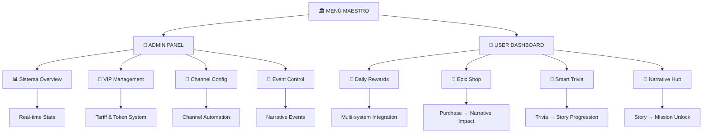

# 🏛️ Diseño del Menú Maestro Unificado - Diana Bot V2

## 🎯 Propósito

Este documento define la arquitectura y diseño del **Menú Maestro Unificado** que consolidará todos los sistemas de administración duplicados en un solo sistema coherente que refleje la naturaleza del ecosistema narrativo-gamificado de Diana Bot.

## 📅 Información del Diseño

- **Fecha de Diseño**: 2025-08-04
- **Arquitecto**: Claude Code AI
- **Basado en**: Análisis de 5 sistemas duplicados + Inventario completo de funciones
- **Estado**: 🏗️ En Diseño - Listo para implementación

---

## 🎨 **FILOSOFÍA DE DISEÑO**

### **Principios Fundamentales:**

1. **🔮 Ecosistema Vivo**: Cada acción desencadena múltiples sistemas
2. **👤 Usuario-Céntrico**: El dashboard muestra el estado integral del usuario
3. **📖 Narrativa-Guiada**: La historia dirige la experiencia
4. **🎯 Gamificación-Impulsada**: Los logros impulsan el progreso
5. **🛡️ Admin-Sostenible**: Control total sin complejidad

### **Arquitectura del Menú:**



---

## 🏛️ **ESTRUCTURA DEL MENÚ MAESTRO**

### **🎭 MENÚ PRINCIPAL (Multi-Modal)**

```python
def get_master_menu_keyboard(user_role: str, user_stats: dict) -> InlineKeyboardMarkup:
    """
    Genera el menú maestro adaptativo basado en rol y estado del usuario.
    
    Args:
        user_role: 'admin', 'vip', 'free'
        user_stats: Estado completo del usuario (puntos, progreso, etc.)
    """
```

#### **Para ADMINISTRADORES:**
```python
buttons = [
    # Fila 1: Control del Ecosistema
    [
        InlineKeyboardButton("🏛️ Sistema Overview", callback_data="master:admin_overview"),
        InlineKeyboardButton("📊 Live Analytics", callback_data="master:live_stats")
    ],
    
    # Fila 2: Gestión VIP y Canales
    [
        InlineKeyboardButton("💎 VIP Control Center", callback_data="master:vip_center"),
        InlineKeyboardButton("🔧 Channel Automation", callback_data="master:channel_auto")
    ],
    
    # Fila 3: Control Narrativo
    [
        InlineKeyboardButton("📖 Narrative Events", callback_data="master:narrative_control"),
        InlineKeyboardButton("🎯 Mission Engine", callback_data="master:mission_engine")
    ],
    
    # Fila 4: Herramientas Admin
    [
        InlineKeyboardButton("🛠️ System Tools", callback_data="master:admin_tools"),
        InlineKeyboardButton("⚙️ Configuration", callback_data="master:config")
    ],
    
    # Fila 5: Experiencia de Usuario (Admin como Usuario)
    [
        InlineKeyboardButton("👤 My Dashboard", callback_data="master:user_dashboard")
    ]
]
```

#### **Para USUARIOS VIP:**
```python
buttons = [
    # Fila 1: Dashboard Personal con Contexto Narrativo
    [
        InlineKeyboardButton(f"👑 VIP Dashboard • {user_stats['level']}", 
                           callback_data="master:vip_dashboard")
    ],
    
    # Fila 2: Experiencias Exclusivas
    [
        InlineKeyboardButton("🎁 VIP Daily Gift", callback_data="master:vip_daily"),
        InlineKeyboardButton("🛒 Exclusive Shop", callback_data="master:vip_shop")
    ],
    
    # Fila 3: Contenido Avanzado
    [
        InlineKeyboardButton("🧠 Master Trivia", callback_data="master:vip_trivia"),
        InlineKeyboardButton("📖 Advanced Story", callback_data="master:vip_narrative")
    ],
    
    # Fila 4: Comunidad VIP
    [
        InlineKeyboardButton("💎 VIP Missions", callback_data="master:vip_missions"),
        InlineKeyboardButton("🏆 Elite Rankings", callback_data="master:vip_rankings")
    ]
]
```

#### **Para USUARIOS FREE:**
```python
buttons = [
    # Fila 1: Dashboard Personal Gamificado
    [
        InlineKeyboardButton(f"🌟 Mi Progreso • Nivel {user_stats['level']}", 
                           callback_data="master:user_dashboard")
    ],
    
    # Fila 2: Actividades Diarias
    [
        InlineKeyboardButton("🎁 Regalo Diario", callback_data="master:daily_reward"),
        InlineKeyboardButton("🧠 Trivia Diaria", callback_data="master:daily_trivia")
    ],
    
    # Fila 3: Economía y Progreso
    [
        InlineKeyboardButton(f"🛒 Tienda • {user_stats['points']} besitos", 
                           callback_data="master:shop"),
        InlineKeyboardButton("📖 Mi Historia", callback_data="master:my_story")
    ],
    
    # Fila 4: Gamificación
    [
        InlineKeyboardButton("🎯 Mis Misiones", callback_data="master:missions"),
        InlineKeyboardButton("🏆 Mis Logros", callback_data="master:achievements")
    ],
    
    # Fila 5: Upgrade Path
    [
        InlineKeyboardButton("💎 Hazte VIP", callback_data="master:upgrade_vip")
    ]
]
```

---

## 🔧 **SISTEMA DE CALLBACKS UNIFICADOS**

### **Arquitectura de Callbacks:**

```python
# Patrón: master:[categoria]:[accion]:[parametro]
CALLBACK_PATTERNS = {
    # Dashboard y Navegación
    "master:admin_overview": AdminOverviewHandler,
    "master:user_dashboard": UserDashboardHandler,
    "master:vip_dashboard": VIPDashboardHandler,
    
    # Funcionalidades Core
    "master:daily_reward": DailyRewardHandler,
    "master:shop": ShopHandler,
    "master:trivia": TriviaHandler,
    "master:missions": MissionsHandler,
    
    # Admin Controls
    "master:vip_center": VIPCenterHandler,
    "master:channel_auto": ChannelAutomationHandler,
    "master:narrative_control": NarrativeControlHandler,
    
    # Navegación Contextual
    "master:back": BackNavigationHandler,
    "master:home": HomeHandler
}
```

---

## 📊 **HANDLERS ESPECIALIZADOS**

### **🏛️ AdminOverviewHandler**
```python
class AdminOverviewHandler:
    """Dashboard ejecutivo del ecosistema completo."""
    
    async def handle(self, callback: CallbackQuery):
        # Recopilar estadísticas en tiempo real
        stats = await self._gather_ecosystem_stats()
        
        text = f"""
🏛️ **DIANA BOT - CONTROL CENTER**

📊 **Sistema Overview**
• Usuarios Activos: {stats['active_users']} (últimas 24h)
• Puntos Generados: {stats['points_generated']} besitos
• Fragmentos Narrativos: {stats['narrative_fragments']} entregados
• Conversiones VIP: {stats['vip_conversions']} este mes

💎 **Estado VIP**
• Suscripciones Activas: {stats['active_subscriptions']}
• Tokens Generados: {stats['tokens_generated']}
• Ingresos Estimados: ${stats['estimated_revenue']}

🎯 **Engagement**
• Trivias Respondidas: {stats['trivia_answered']}
• Misiones Completadas: {stats['missions_completed']}
• Compras Realizadas: {stats['purchases_made']}

📖 **Narrativa**
• Progreso Promedio: {stats['avg_narrative_progress']}%
• Usuarios en Historia: {stats['users_in_story']}
• Eventos Activos: {stats['active_events']}
        """
        
        keyboard = InlineKeyboardMarkup([
            [
                InlineKeyboardButton("📈 Analytics Detallado", 
                                   callback_data="master:detailed_analytics"),
                InlineKeyboardButton("🔄 Refresh", 
                                   callback_data="master:admin_overview")
            ],
            [
                InlineKeyboardButton("💎 VIP Control", 
                                   callback_data="master:vip_center"),
                InlineKeyboardButton("📖 Narrative Control", 
                                   callback_data="master:narrative_control")
            ],
            [
                InlineKeyboardButton("⚙️ Sistema Config", 
                                   callback_data="master:config"),
                InlineKeyboardButton("🛠️ Admin Tools", 
                                   callback_data="master:admin_tools")
            ]
        ])
        
        await callback.message.edit_text(text, reply_markup=keyboard)
```

### **👤 UserDashboardHandler**
```python
class UserDashboardHandler:
    """Dashboard integral del usuario conectando todos los sistemas."""
    
    async def handle(self, callback: CallbackQuery):
        user_id = callback.from_user.id
        
        # Recopilar estado completo del usuario
        user_stats = await self._gather_user_complete_stats(user_id)
        
        # Narrativa personalizada
        narrative_status = await self._get_narrative_context(user_id)
        
        text = f"""
🌟 **¡Hola, {callback.from_user.first_name}!**

{narrative_status['current_fragment']}

📊 **Tu Progreso**
• Nivel: {user_stats['level']} ⭐ ({user_stats['xp']}/{user_stats['next_level_xp']} XP)
• Besitos: {user_stats['points']} 💰
• Racha Diaria: {user_stats['daily_streak']} días 🔥

🎯 **Actividad Hoy**
• Regalo Diario: {self._format_daily_status(user_stats['daily_reward'])}
• Trivia: {self._format_trivia_status(user_stats['trivia'])}
• Misiones: {user_stats['active_missions']}/{user_stats['total_missions']} activas

📖 **Tu Historia**
• Progreso: {user_stats['narrative_progress']}%
• Fragmentos: {user_stats['fragments_collected']}/{user_stats['total_fragments']}
• Pistas: {user_stats['clues_collected']} 🔍

🏆 **Logros Recientes**
{self._format_recent_achievements(user_stats['recent_achievements'])}

💭 *{narrative_status['diana_message']}*
        """
        
        keyboard = self._get_adaptive_dashboard_keyboard(user_stats)
        await callback.message.edit_text(text, reply_markup=keyboard)
```

### **🎁 DailyRewardHandler (Ecosistema Integrado)**
```python
class DailyRewardHandler:
    """Handler que conecta regalos diarios con todo el ecosistema."""
    
    async def handle(self, callback: CallbackQuery):
        user_id = callback.from_user.id
        
        # Verificar disponibilidad
        can_claim = await self.daily_rewards_service.can_claim_daily_reward(user_id)
        
        if can_claim:
            # Reclamar regalo
            result = await self.daily_rewards_service.claim_daily_reward(user_id)
            
            if result["success"]:
                reward = result["reward"]
                
                # 🔥 INTEGRACIÓN ECOSISTÉMICA
                ecosystem_effects = await self._trigger_ecosystem_effects(user_id, reward)
                
                text = f"""
🎁 **¡REGALO RECLAMADO!**

{reward.icon} **{reward.name}**
{reward.description}

🔥 **Racha**: {result["consecutive_days"]} días consecutivos
⭐ **Efectos**: {result["effect"]["effects"]}

🌟 **Impacto en tu Historia**:
{ecosystem_effects['narrative_impact']}

🎯 **Misiones Desbloqueadas**:
{ecosystem_effects['missions_unlocked']}

💭 *Diana: "{self._get_diana_daily_message(result["consecutive_days"])}"*
                """
                
                keyboard = InlineKeyboardMarkup([
                    [
                        InlineKeyboardButton("📖 Ver Mi Historia", 
                                           callback_data="master:my_story"),
                        InlineKeyboardButton("🎯 Ver Misiones", 
                                           callback_data="master:missions")
                    ],
                    [
                        InlineKeyboardButton("🏆 Dashboard", 
                                           callback_data="master:user_dashboard")
                    ]
                ])
            else:
                text = f"❌ {result['reason']}"
                keyboard = self._get_back_keyboard()
        else:
            # Mostrar estado y cuándo puede reclamar
            stats = await self.daily_rewards_service.get_user_daily_stats(user_id)
            text = self._format_daily_status_waiting(stats)
            keyboard = self._get_waiting_keyboard(stats)
        
        await callback.message.edit_text(text, reply_markup=keyboard)
```

---

## 🛒 **SHOP HANDLER ECOSISTÉMICO**

```python
class ShopHandler:
    """Tienda que conecta compras con narrativa y progreso."""
    
    async def handle(self, callback: CallbackQuery):
        user_id = callback.from_user.id
        
        # Obtener contexto completo
        user_points = await self.gamification_service.get_points(user_id)
        narrative_context = await self.narrative_service.get_user_narrative_state(user_id)
        
        # Items recomendados basados en progreso narrativo
        recommended_items = await self.shop_service.get_recommended_items(
            user_id, narrative_context
        )
        
        text = f"""
🛒 **TIENDA DE DIANA** 

💰 **Tus Besitos**: {user_points}

🌟 **Recomendado para ti**:
{self._format_recommended_items(recommended_items)}

📖 **Items Narrativos**: Objetos que avanzan tu historia
🎯 **Boosters de Gamificación**: Acelera tu progreso  
💎 **Acceso VIP**: Desbloquea contenido exclusivo
🎁 **Items Especiales**: Efectos únicos y sorpresas
        """
        
        keyboard = InlineKeyboardMarkup([
            [
                InlineKeyboardButton("📖 Narrativa", 
                                   callback_data="master:shop:narrative"),
                InlineKeyboardButton("🎯 Gamificación", 
                                   callback_data="master:shop:gamification")
            ],
            [
                InlineKeyboardButton("💎 VIP", 
                                   callback_data="master:shop:vip"),
                InlineKeyboardButton("🎁 Especiales", 
                                   callback_data="master:shop:special")
            ],
            [
                InlineKeyboardButton("🏆 Mi Dashboard", 
                                   callback_data="master:user_dashboard")
            ]
        ])
        
        await callback.message.edit_text(text, reply_markup=keyboard)
```

---

## 🎯 **SISTEMA DE NAVEGACIÓN INTELIGENTE**

### **BackNavigationHandler**
```python
class BackNavigationHandler:
    """Navegación contextual inteligente."""
    
    NAVIGATION_CONTEXT = {
        "master:admin_overview": "master:admin_root",
        "master:user_dashboard": "master:user_root", 
        "master:shop:narrative": "master:shop",
        "master:vip_center": "master:admin_overview",
        # ...
    }
    
    async def handle(self, callback: CallbackQuery):
        current_context = callback.data.replace("master:back:", "")
        previous_context = self.NAVIGATION_CONTEXT.get(current_context, "master:home")
        
        # Redireccionar al contexto previo
        await self._redirect_to_context(callback, previous_context)
```

---

## 🏗️ **ARQUITECTURA DE IMPLEMENTACIÓN**

### **Estructura de Archivos:**
```
src/bot/handlers/master/
├── __init__.py                 # Registro del sistema maestro
├── master_menu.py             # Menú principal adaptativo
├── admin/
│   ├── overview_handler.py    # Dashboard administrativo
│   ├── vip_center_handler.py  # Control VIP completo
│   ├── channel_automation.py  # Automatización de canales
│   └── narrative_control.py   # Control de eventos narrativos
├── user/
│   ├── dashboard_handler.py   # Dashboard integral usuario
│   ├── daily_reward_handler.py # Regalos con integración ecosistémica
│   ├── shop_handler.py        # Tienda conectada a narrativa
│   ├── trivia_handler.py      # Trivias narrativas
│   └── missions_handler.py    # Misiones conectadas
├── shared/
│   ├── navigation.py          # Sistema de navegación inteligente
│   ├── ecosystem_integration.py # Efectos multi-sistema
│   └── context_manager.py     # Gestión de contexto del usuario
└── keyboards/
    ├── master_keyboards.py    # Teclados adaptativos
    ├── admin_keyboards.py     # Teclados administrativos
    └── user_keyboards.py      # Teclados de usuario
```

### **Registro del Sistema:**
```python
# src/bot/handlers/master/__init__.py
def register_master_handlers(dp: Dispatcher, services: dict):
    """Registra el sistema maestro unificado."""
    
    # Router principal
    master_router = Router()
    
    # Registrar handlers por categoría
    register_admin_handlers(master_router, services)
    register_user_handlers(master_router, services)
    register_navigation_handlers(master_router, services)
    
    # Registrar en dispatcher
    dp.include_router(master_router)
    
    logger.info("🏛️ Master Menu System registered successfully")
```

---

## 🔄 **INTEGRACIÓN CON SERVICIOS EXISTENTES**

### **Inyección de Dependencias:**
```python
class MasterMenuService:
    """Servicio central que coordina todos los demás servicios."""
    
    def __init__(self, 
                 admin_service: AdminService,
                 gamification_service: GamificationService,
                 shop_service: ShopService,
                 daily_rewards_service: DailyRewardsService,
                 trivia_service: TriviaService,
                 narrative_service: NarrativeService,
                 event_bus: IEventBus):
        self.admin = admin_service
        self.gamification = gamification_service
        self.shop = shop_service
        self.daily_rewards = daily_rewards_service
        self.trivia = trivia_service
        self.narrative = narrative_service  
        self.event_bus = event_bus
    
    async def get_user_complete_state(self, user_id: int) -> dict:
        """Recopila el estado completo del usuario de todos los servicios."""
        return {
            'points': await self.gamification.get_points(user_id),
            'missions': await self.gamification.get_user_missions(user_id),
            'achievements': await self.gamification.get_user_achievements(user_id),
            'daily_reward': await self.daily_rewards.can_claim_daily_reward(user_id),
            'trivia_status': await self.trivia.can_answer_daily(user_id),
            'narrative_progress': await self.narrative.get_user_progress(user_id),
            # ...
        }
```

---

## 📊 **MÉTRICAS Y ANALYTICS**

### **Dashboard Metrics:**
```python
class EcosystemMetrics:
    """Métricas en tiempo real del ecosistema."""
    
    async def gather_live_stats(self) -> dict:
        """Recopila estadísticas en tiempo real de todos los servicios."""
        return {
            # User Engagement
            'active_users_24h': await self._count_active_users(24),
            'daily_rewards_claimed': await self._count_daily_rewards_today(),
            'trivia_answered': await self._count_trivia_today(),
            'purchases_made': await self._count_purchases_today(),
            
            # Narrative Progress
            'narrative_fragments_delivered': await self._count_fragments_today(),
            'users_advancing_story': await self._count_story_progress(),
            'average_narrative_progress': await self._calc_avg_progress(),
            
            # VIP System
            'active_subscriptions': await self._count_active_subs(),
            'tokens_generated_today': await self._count_tokens_today(),
            'vip_conversions': await self._count_vip_conversions(),
            
            # Gamification
            'points_generated': await self._sum_points_today(),
            'missions_completed': await self._count_missions_completed(),
            'level_ups': await self._count_level_ups_today(),
        }
```

---

## 🛡️ **SEGURIDAD Y ROLES**

### **Sistema de Autorización:**
```python
class MasterMenuSecurity:
    """Sistema de seguridad para el menú maestro."""
    
    ROLE_PERMISSIONS = {
        'admin': [
            'admin_overview', 'vip_center', 'channel_automation',
            'narrative_control', 'system_config', 'user_dashboard'
        ],
        'vip': [
            'vip_dashboard', 'vip_shop', 'vip_trivia', 
            'vip_narrative', 'user_dashboard'  
        ],
        'free': [
            'user_dashboard', 'daily_reward', 'shop', 
            'trivia', 'missions', 'achievements'
        ]
    }
    
    async def check_permission(self, user_id: int, action: str) -> bool:
        """Verifica si el usuario tiene permiso para la acción."""
        user_role = await self._get_user_role(user_id)
        return action in self.ROLE_PERMISSIONS.get(user_role, [])
```

---

## 🚀 **PLAN DE IMPLEMENTACIÓN**

### **Fase 1: Base del Sistema Maestro (2-3 horas)**
1. ✅ Crear estructura de archivos
2. ✅ Implementar MasterMenuService  
3. ✅ Crear keyboards adaptativos básicos
4. ✅ Registrar sistema en dispatcher

### **Fase 2: Handlers Core (3-4 horas)**
1. ✅ UserDashboardHandler con integración completa
2. ✅ DailyRewardHandler ecosistémico
3. ✅ ShopHandler conectado a narrativa
4. ✅ Sistema de navegación inteligente

### **Fase 3: Panel Administrativo (4-5 horas)**
1. ✅ AdminOverviewHandler con métricas en tiempo real
2. ✅ VIPCenterHandler completo
3. ✅ ChannelAutomationHandler
4. ✅ NarrativeControlHandler

### **Fase 4: Optimización y Testing (2-3 horas)**
1. ✅ Testing integral de todos los flujos
2. ✅ Optimización de performance
3. ✅ Documentación de APIs
4. ✅ Deployment y monitoreo

---

## 🎯 **RESULTADOS ESPERADOS**

### **Para Usuarios:**
- ✅ **Dashboard Unificado**: Todo su progreso en una vista
- ✅ **Experiencia Fluida**: Navegación intuitiva entre funciones
- ✅ **Narrativa Integrada**: Cada acción conecta con la historia
- ✅ **Gamificación Rica**: Progreso visible y recompensas claras

### **Para Administradores:**
- ✅ **Control Total**: Visión completa del ecosistema
- ✅ **Métricas en Tiempo Real**: Decisiones basadas en datos
- ✅ **Gestión Eficiente**: Todas las herramientas en un lugar
- ✅ **Automatización**: Menos trabajo manual, más estrategia

### **Para Desarrolladores:**
- ✅ **Código Limpio**: Un sistema, una responsabilidad
- ✅ **Fácil Mantenimiento**: Cambios en un solo lugar
- ✅ **Testing Simplificado**: Superficie de prueba reducida
- ✅ **Extensibilidad**: Fácil agregar nuevas funciones

---

## 📚 **Referencias Técnicas**

### **Servicios Integrados:**
- `AdminService` - Gestión administrativa completa
- `GamificationService` - Sistema de puntos, misiones, logros
- `ShopService` - Tienda con 12+ productos implementados
- `DailyRewardsService` - Sistema de regalos con rachas
- `TriviaService` - Trivias diarias con 15+ preguntas
- `NarrativeService` - Sistema de fragmentos y pistas

### **Arquitectura Base:**
- Event Bus para comunicación entre módulos
- Dependency Injection con containers
- Clean Architecture con separación de capas
- Async/await para performance

### **Testing Strategy:**
- Unit tests para cada handler
- Integration tests para flujos completos
- Manual testing con escenarios reales
- Performance testing para métricas

---

## 📞 **Próximos Pasos**

1. **✅ Aprobación del Diseño**: Revisar arquitectura propuesta
2. **🏗️ Implementación Fase 1**: Crear base del sistema maestro
3. **🔄 Testing Iterativo**: Probar cada componente por separado
4. **🚀 Deployment Gradual**: Activar funciones progresivamente
5. **📊 Monitoreo**: Verificar métricas y performance

---

*Este diseño consolidará los 5 sistemas duplicados en un solo menú maestro que refleje la verdadera naturaleza del ecosistema narrativo-gamificado de Diana Bot V2.*