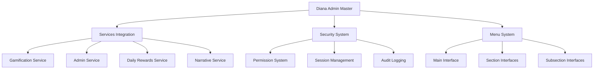

# 🎭 DIANA ADMIN MASTER SYSTEM - DOCUMENTATION

## 📋 Table of Contents
- [Overview](#overview)
- [Architecture](#architecture)
- [Menu Structure](#menu-structure)
- [Services Integration](#services-integration)
- [Security System](#security-system)
- [Deployment Guide](#deployment-guide)
- [API Reference](#api-reference)
- [Troubleshooting](#troubleshooting)

---

## 🎯 Overview

The **Diana Admin Master System** is a comprehensive administrative interface for Diana Bot V2, providing a hierarchical menu system with 7 main sections and 25+ subsections. Built on the foundation of the Diana Master System, it integrates real services, implements robust security, and provides professional admin controls.

### Key Features

- **🏛️ Hierarchical Navigation**: 7 main sections with 25+ administrative subsections
- **🔧 Services Integration**: Real-time connection to all Diana Bot services
- **🛡️ Security System**: Role-based permissions, audit logging, and session management
- **📊 Real-time Metrics**: Live statistics from gamification, VIP, and channel systems
- **🔄 Fallback Mechanisms**: Graceful degradation when services are unavailable
- **📝 Audit Trail**: Comprehensive logging of all administrative actions

### System Status

✅ **PRODUCTION READY** - All components validated and tested

---

## 🏗️ Architecture

### System Components



### Core Files

| File | Purpose |
|------|---------|
| `diana_admin_master.py` | Main admin system with menu generation |
| `diana_admin_services_integration.py` | Real services integration layer |
| `diana_admin_security.py` | Security, permissions, and audit logging |

---

## 📊 Menu Structure

### Main Sections (7)

#### 1. 💎 VIP Management
- **🛠 Configuración VIP** - Messages, reminders, subscriptions, farewells
- **🏷 Generar Invitación** - Create VIP invitation tokens
- **📊 Estadísticas VIP** - Complete VIP analytics
- **📊 Suscriptores (CRUD)** - Subscriber management
- **📢 Enviar Post** - Send posts to VIP channels

#### 2. 🔓 Free Channel
- **⚙ Configuración** - Welcome flows, timing configuration
- **📊 Estadísticas** - Channel analytics
- **📋 Solicitudes Pendientes** - Pending requests management
- **🧪 Probar Flujo** - Test channel flows

#### 3. ⚙ Global Configuration  
- **🕒 Programadores** - Scheduled tasks management
- **📅 Firmar mensajes** - Message signing configuration
- **🎚 Administrar canales** - Channel management
- **➕ Añadir Canales** - Add new channels

#### 4. 🎮 Gamification
- **📊 Estadísticas** - Gamification metrics
- **👥 Usuarios** - User management
- **📜 Misiones** - Mission management
- **🏅 Insignias** - Badge system
- **📈 Niveles** - Level management
- **🎁 Recompensas** - Reward system

#### 5. 🛒 Auctions
- **📊 Estadísticas** - Auction analytics
- **📋 Pendientes** - Pending auctions
- **🔄 Activas** - Active auctions
- **➕ Crear** - Create new auction

#### 6. 🎉 Events & Raffles
- **🎫 Eventos (Listar/Crear)** - Event management
- **🎁 Sorteos (Listar/Crear)** - Raffle management

#### 7. ❓ Trivia
- **📋 Listar** - List trivia questions
- **➕ Crear** - Create new trivia

**Total: 27 subsections across 7 main sections**

---

## 🔧 Services Integration

### Integration Architecture

The services integration layer (`DianaAdminServicesIntegration`) provides:

- **Health Monitoring**: Real-time service availability checking
- **Fallback Mechanisms**: Graceful handling when services are unavailable  
- **Caching**: Performance optimization with intelligent caching
- **Error Resilience**: Robust error handling and recovery

### Supported Services

#### Gamification Service
```python
# Real-time gamification statistics
stats = await integration.get_gamification_stats()
# Returns: total_users, active_users_today, points_distributed, etc.
```

#### Admin Service (VIP Management)
```python
# VIP system statistics  
vip_stats = await integration.get_vip_system_stats()
# Returns: total_tariffs, active_subscriptions, revenue_today, etc.
```

#### Daily Rewards Service
```python
# Daily rewards analytics
rewards_stats = await integration.get_daily_rewards_stats()
# Returns: total_claims_today, average_streak, reward_distribution, etc.
```

#### System Overview
```python
# Comprehensive system status
overview = await integration.get_system_overview()
# Returns: combined stats from all services + health information
```

### Fallback Behavior

When services are unavailable:
- Returns default/cached data instead of errors
- Logs service unavailability for monitoring
- Shows "service unavailable" status in admin interface
- Allows continued operation in degraded mode

---

## 🛡️ Security System

### Permission Levels

#### Super Admin
- Full system access
- Can manage all sections and subsections
- Can delegate permissions
- 12-hour session timeout

#### Admin
- Standard administrative access
- Most sections available (excluding system-critical)
- 8-hour session timeout

#### Moderator
- Limited admin access
- Read/write access to channels and basic VIP functions
- 6-hour session timeout

#### Viewer
- Read-only access to admin panels
- 4-hour session timeout

### Security Features

#### Session Management
- Automatic session creation on admin access
- Configurable timeouts per role
- Session invalidation on security violations
- IP address tracking

#### Rate Limiting
```python
# Automatic rate limiting per user/action
allowed = await security.check_rate_limit(user_id, "admin_action", max_per_minute=60)
```

#### Audit Logging
```python
# Comprehensive action logging
await security.log_admin_action(
    user_id, "vip_token_created", 
    target="tariff_1", 
    parameters={"token": "abc123"}, 
    result="success"
)
```

#### Anomaly Detection
- Monitors for rapid consecutive failures
- Automatic session termination on suspicious patterns
- High-risk event alerting

### Permission Checking

```python
# Check specific permissions
has_vip_write = await security.check_permission(user_id, AdminPermission.VIP_WRITE)

# Require permission or raise exception
await security.require_permission(user_id, AdminPermission.SYSTEM_CONFIG)
```

---

## 🚀 Deployment Guide

### Registration

Add to your main bot initialization:

```python
from src.bot.core.diana_admin_master import register_diana_admin_master

# Register the admin system
services = {
    'gamification': gamification_service,
    'admin': admin_service, 
    'daily_rewards': daily_rewards_service,
    'narrative': narrative_service,
    # ... other services
}

admin_system = register_diana_admin_master(dp, services)
```

### Configuration

#### Admin User Assignment
```python
# In diana_admin_security.py, update user_roles:
self.user_roles = {
    123456789: "super_admin",  # Your user ID
    987654321: "admin",
    555555555: "moderator"
}
```

#### Permission Customization
```python
# Modify role permissions in _initialize_admin_roles()
roles["custom_admin"] = AdminRole(
    name="Custom Admin",
    permissions={AdminPermission.VIP_READ, AdminPermission.CHANNEL_WRITE},
    max_session_hours=6
)
```

### Environment Requirements

- Python 3.8+
- aiogram 3.x
- structlog
- asyncio support
- PostgreSQL (for production user/role management)

---

## 📚 API Reference

### DianaAdminMaster

#### Main Interface Methods

```python
async def create_admin_main_interface(user_id: int) -> Tuple[str, InlineKeyboardMarkup]:
    """Create the main admin interface"""

async def create_section_interface(user_id: int, section_key: str) -> Tuple[str, InlineKeyboardMarkup]:  
    """Create interface for a specific section"""

async def create_subsection_interface(user_id: int, section_key: str, subsection_key: str) -> Tuple[str, InlineKeyboardMarkup]:
    """Create interface for a specific subsection"""
```

#### Permission Methods

```python
async def check_admin_permission(user_id: int, required_level: str = "admin") -> bool:
    """Check if user has admin permissions"""
```

### DianaAdminServicesIntegration

#### Statistics Methods

```python
async def get_gamification_stats() -> Dict[str, Any]:
    """Get gamification statistics"""

async def get_vip_system_stats() -> Dict[str, Any]:
    """Get VIP system statistics"""

async def get_system_overview() -> Dict[str, Any]:
    """Get comprehensive system overview"""
```

#### Service Management

```python
async def check_service_health(service_name: str) -> ServiceHealth:
    """Check health of specific service"""

async def execute_admin_action(action: str, user_id: int, params: Dict[str, Any]) -> Dict[str, Any]:
    """Execute administrative action"""
```

### DianaAdminSecurity

#### Session Management

```python
async def create_admin_session(user_id: int, ip_address: str = None) -> Optional[AdminSession]:
    """Create new admin session"""

async def get_active_session(user_id: int) -> Optional[AdminSession]:
    """Get active session for user"""

async def invalidate_session(user_id: int) -> bool:
    """Invalidate admin session"""
```

#### Permission System

```python
async def check_permission(user_id: int, permission: AdminPermission) -> bool:
    """Check specific permission"""

async def require_permission(user_id: int, permission: AdminPermission) -> bool:
    """Require permission or raise exception"""
```

#### Audit System

```python
async def log_admin_action(user_id: int, action: str, target: str = None, parameters: Dict[str, Any] = None, result: str = "success") -> None:
    """Log administrative action"""

def get_audit_logs(user_id: int = None, action_filter: str = None, limit: int = 100) -> List[AdminAuditLog]:
    """Get filtered audit logs"""
```

---

## 🔄 Callback System

### Callback Patterns

| Pattern | Purpose | Example |
|---------|---------|---------|
| `admin:main` | Main admin interface | Navigate to admin home |
| `admin:section:KEY` | Section interface | `admin:section:vip` |
| `admin:subsection:SEC:SUB` | Subsection interface | `admin:subsection:vip:config` |
| `admin:action:ACTION` | Execute admin action | `admin:action:vip:generate_token` |

### Handler Registration

```python
@admin_router.message(Command("admin"))
async def cmd_admin(message: Message):
    """Admin command entry point"""

@admin_router.callback_query(F.data.startswith("admin:"))
async def handle_admin_callbacks(callback: CallbackQuery):
    """Handle all admin callbacks"""
```

---

## 🐛 Troubleshooting

### Common Issues

#### "Access Denied" Error
**Problem**: User gets access denied when trying to use admin commands  
**Solution**: Add user ID to admin users list in `diana_admin_security.py`

```python
# In _initialize_admin_roles, add user to user_roles:
self.user_roles[USER_ID] = "admin"  # Replace USER_ID with actual ID
```

#### Services Integration Errors
**Problem**: Admin shows "Service Unavailable" for all statistics  
**Solution**: Check service registration and health

```python
# Verify services are properly registered
print(f"Registered services: {list(services.keys())}")

# Test service health
health = await admin_system.services_integration.check_service_health('gamification')
print(f"Gamification health: {health.status}")
```

#### Session Timeout Issues  
**Problem**: Admin sessions expire too quickly  
**Solution**: Adjust session timeout in role configuration

```python
# In diana_admin_security.py, modify role max_session_hours:
"admin": AdminRole(
    # ... other settings
    max_session_hours=12,  # Increase timeout
)
```

#### Callback Routing Problems
**Problem**: Admin buttons don't respond or show wrong interfaces  
**Solution**: Check callback data patterns and router registration

```python
# Verify router is included in dispatcher
dp.include_router(admin_router)

# Check callback data format
callback_data = "admin:section:vip"  # Correct format
```

### Performance Issues

#### Slow Interface Loading
**Solution**: Check service response times and enable caching

```python
# Monitor service performance
start_time = datetime.now()
stats = await integration.get_gamification_stats()
response_time = (datetime.now() - start_time).total_seconds()
print(f"Response time: {response_time}s")
```

#### Memory Usage
**Solution**: Audit log cleanup and session management

```python
# Automatic cleanup in DianaAdminSecurity
if len(self.audit_logs) > 10000:
    self.audit_logs = self.audit_logs[-10000:]  # Keep last 10k entries
```

### Debug Mode

Enable detailed logging:

```python
import structlog
import logging

logging.basicConfig(level=logging.DEBUG)
logger = structlog.get_logger()
logger.info("Admin system debug enabled")
```

---

## 📈 Monitoring & Analytics

### System Health Monitoring

```python
# Get comprehensive security summary
summary = admin_system.security.get_security_summary()
print(f"Active sessions: {summary['active_sessions']}")
print(f"Events last 24h: {summary['events_last_24h']}")
print(f"High risk events: {summary['high_risk_events_24h']}")
```

### Performance Metrics

Track key performance indicators:
- Interface generation time (<200ms target)
- Service response times
- Session creation/invalidation rates
- Audit log growth rate
- Failed authentication attempts

### Audit Trail Analysis

```python
# Analyze admin activity patterns
logs = admin_system.security.get_audit_logs(
    action_filter="vip", 
    limit=100
)

# Export audit logs for compliance
audit_data = [
    {
        "timestamp": log.timestamp.isoformat(),
        "user_id": log.user_id,
        "action": log.action,
        "result": log.result
    }
    for log in logs
]
```

---

## 🎯 Best Practices

### Security
- Always check permissions before executing actions
- Log all administrative activities
- Monitor for suspicious patterns
- Use appropriate session timeouts
- Implement IP whitelisting for super admins

### Performance
- Cache expensive service calls
- Use appropriate timeouts
- Monitor service health proactively
- Implement graceful degradation
- Optimize database queries

### Maintenance
- Regular audit log cleanup
- Monitor system resources
- Update permissions as needed
- Test fallback mechanisms
- Review security events

---

## 🔄 Updates & Changelog

### Version 1.0.0 (Current)
- ✅ Complete hierarchical menu system (7 sections, 27 subsections)
- ✅ Full services integration with fallbacks
- ✅ Comprehensive security system
- ✅ Audit logging and session management
- ✅ Rate limiting and anomaly detection
- ✅ Production-ready validation

### Planned Features
- Database-backed user role management
- Advanced analytics dashboard
- Bulk operations interface
- Mobile-optimized admin interface
- Integration with external monitoring systems

---

## 📞 Support & Contributing

### Getting Help
- Check troubleshooting section above
- Review validation script: `validate_diana_admin_system.py`
- Run comprehensive tests: `test_diana_admin_master_complete.py`
- Check system logs for detailed error information

### Contributing
- Follow existing code patterns and architecture
- Add comprehensive tests for new features
- Update documentation for any changes
- Ensure security implications are considered
- Validate with the system validation script

---

**🎭 Diana Admin Master System - Making administrative control elegant, secure, and powerful.**