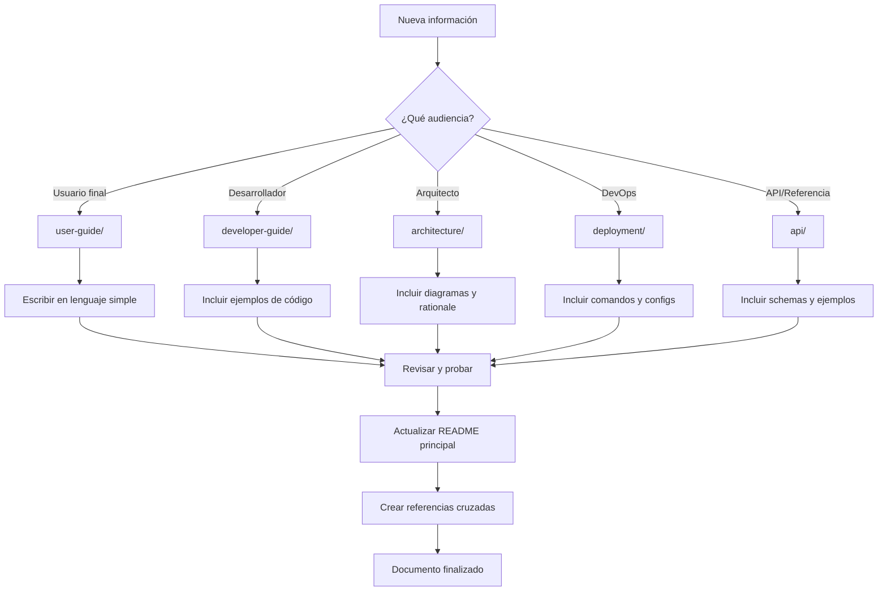

# 📖 Guía de Documentación - Diana Bot V2

## 🎯 Propósito de Esta Guía

Esta guía establece la **metodología estándar** para documentar Diana Bot V2, asegurando que toda nueva información se organice correctamente y no se vuelva a dispersar la documentación.

---

## 📁 **Estructura de Documentación Definida**

### 🗂️ **Carpetas y Su Propósito**

```
docs/
├── 📖 README.md                    # Índice principal - NUNCA documentar aquí
├── 👤 user-guide/                 # Para usuarios finales del bot
├── 🛠️ developer-guide/            # Para desarrolladores y contributors
├── 🏗️ architecture/               # Arquitectura técnica del sistema
├── 📡 api/                        # APIs, interfaces y contratos
└── 🚀 deployment/                 # Despliegue, configuración y ops
```

---

## 🎯 **¿Dónde Documentar Qué?**

### 👤 **user-guide/** - "¿Cómo uso el bot?"

**Audiencia**: Usuarios finales, admins de canales, usuarios VIP

#### 📝 **Qué va aquí:**
- ✅ Comandos disponibles (`/start`, `/shop`, `/trivia`, etc.)
- ✅ Cómo usar las funcionalidades (gamificación, narrativa)
- ✅ Explicaciones de sistemas (besitos, misiones, logros)
- ✅ Guías paso a paso para usuarios
- ✅ FAQ de usuarios
- ✅ Troubleshooting básico

#### ❌ **Qué NO va aquí:**
- ❌ Código o implementaciones técnicas
- ❌ Arquitectura del sistema
- ❌ Configuración de desarrollo
- ❌ APIs o interfaces técnicas

#### 📋 **Archivos Sugeridos:**
```
user-guide/
├── 01-introduccion.md          # ¿Qué es Diana Bot?
├── 02-comandos.md              # Lista completa de comandos
├── 03-gamificacion.md          # Sistema de besitos/misiones
├── 04-narrativa.md             # Historia interactiva
├── 05-tienda.md                # Cómo comprar objetos
├── 06-vip.md                   # Funcionalidades premium
├── 07-admin-guide.md           # Guía para admins de canal
└── 08-faq.md                   # Preguntas frecuentes
```

---

### 🛠️ **developer-guide/** - "¿Cómo desarrollo en el bot?"

**Audiencia**: Desarrolladores, contributors, maintainers

#### 📝 **Qué va aquí:**
- ✅ Setup de entorno de desarrollo
- ✅ Convenciones de código y estilo
- ✅ Cómo contribuir al proyecto
- ✅ Workflows de desarrollo
- ✅ Testing y debugging
- ✅ Herramientas de desarrollo
- ✅ Guías de implementación de features

#### ❌ **Qué NO va aquí:**
- ❌ Detalles de arquitectura (va en architecture/)
- ❌ Documentación de APIs (va en api/)
- ❌ Guías de usuario final
- ❌ Configuración de producción (va en deployment/)

#### 📋 **Archivos Sugeridos:**
```
developer-guide/
├── 01-setup.md                 # Configuración del entorno
├── 02-estructura.md            # Estructura del proyecto
├── 03-convenciones.md          # Estándares de código
├── 04-testing.md               # Estrategia de pruebas
├── 05-contribucion.md          # Cómo contribuir
├── 06-workflows.md             # Flujos de trabajo
├── 07-debugging.md             # Debugging y troubleshooting
├── 08-new-features.md          # Cómo agregar funcionalidades
└── 09-tools.md                 # Herramientas de desarrollo
```

---

### 🏗️ **architecture/** - "¿Cómo está construido el sistema?"

**Audiencia**: Arquitectos, senior developers, technical leads

#### 📝 **Qué va aquí:**
- ✅ Decisiones arquitectónicas y rationale
- ✅ Diagramas de sistema y componentes
- ✅ Patrones de diseño implementados
- ✅ Event Bus y comunicación entre módulos
- ✅ Estrategias de escalabilidad
- ✅ Análisis de performance
- ✅ Modelos de datos y relaciones

#### ❌ **Qué NO va aquí:**
- ❌ Guías de setup (va en developer-guide/)
- ❌ Comandos de usuario (va en user-guide/)
- ❌ Detalles de implementación específicos
- ❌ Configuración de deployment

#### 📋 **Archivos Sugeridos:**
```
architecture/
├── 01-vision-general.md        # Principios y visión arquitectónica
├── 02-event-bus.md             # Sistema de eventos
├── 03-servicios.md             # Módulos y servicios
├── 04-base-datos.md            # Modelos y relaciones
├── 05-diana-integration.md     # Integración externa Diana
├── 06-security.md              # Arquitectura de seguridad
├── 07-performance.md           # Estrategias de performance
└── 08-scalability.md           # Planificación de escalabilidad
```

---

### 📡 **api/** - "¿Cómo interactúan los componentes?"

**Audiencia**: Developers trabajando con integraciones, APIs internas

#### 📝 **Qué va aquí:**
- ✅ Documentación de Event Bus (eventos disponibles)
- ✅ Interfaces de servicios (métodos públicos)
- ✅ Modelos de datos (schemas)
- ✅ Handlers de Telegram (callbacks, comandos)
- ✅ APIs externas (Diana validation, etc.)
- ✅ Contratos entre módulos

#### ❌ **Qué NO va aquí:**
- ❌ Explicaciones de alto nivel (va en architecture/)
- ❌ Guías de usuario (va en user-guide/)
- ❌ Setup de desarrollo
- ❌ Filosofía arquitectónica

#### 📋 **Archivos Sugeridos:**
```
api/
├── event-bus.md                # Eventos y suscriptores
├── services.md                 # APIs de servicios internos
├── models.md                   # Modelos de datos y schemas
├── handlers.md                 # Handlers de Telegram
├── external-apis.md            # APIs externas (Diana, etc.)
└── contracts.md                # Contratos entre módulos
```

---

### 🚀 **deployment/** - "¿Cómo se despliega y opera?"

**Audiencia**: DevOps, SRE, production maintainers

#### 📝 **Qué va aquí:**
- ✅ Configuración de producción
- ✅ Variables de entorno requeridas
- ✅ Procesos de deployment
- ✅ Monitoreo y logging
- ✅ Backup y disaster recovery
- ✅ Scaling y performance tuning
- ✅ Troubleshooting de producción

#### ❌ **Qué NO va aquí:**
- ❌ Setup de desarrollo (va en developer-guide/)
- ❌ Arquitectura del sistema (va en architecture/)
- ❌ Guías de usuario
- ❌ Documentación de código

#### 📋 **Archivos Sugeridos:**
```
deployment/
├── production.md               # Setup de producción
├── environment.md              # Variables de entorno
├── monitoring.md               # Logs, métricas, alertas
├── backup.md                   # Estrategias de backup
├── scaling.md                  # Escalamiento horizontal/vertical
└── troubleshooting.md          # Problemas comunes de prod
```

---

## 🔄 **Flujo de Documentación**

### **Antes de Escribir - Pregúntate:**

1. **🎯 ¿Quién es mi audiencia?**
   - Usuario final → `user-guide/`
   - Desarrollador → `developer-guide/`
   - Arquitecto → `architecture/`
   - DevOps → `deployment/`

2. **📝 ¿Qué tipo de información es?**
   - Instructivo/Tutorial → `user-guide/` o `developer-guide/`
   - Técnica/Arquitectural → `architecture/`
   - Referencia/API → `api/`
   - Operacional → `deployment/`

3. **🔍 ¿Ya existe documentación similar?**
   - Actualizar documento existente
   - Crear nuevo archivo si es tema independiente
   - Referenciar documentos relacionados

### **Proceso de Documentación:**



---

## 📋 **Plantillas de Documentos**

### **Plantilla Básica para Cualquier Documento:**

```markdown
# 🎯 [Título del Documento]

## 🎯 Propósito
Breve descripción de qué cubre este documento y para quién está dirigido.

## 📋 Contenido Principal
[Contenido específico del documento]

## 🔗 Referencias
- [Documento relacionado 1](enlace)
- [Documento relacionado 2](enlace)

## 📅 Historial
- **Creado**: [Fecha] - [Autor]
- **Última actualización**: [Fecha] - [Cambios]

---
*Documento parte de la documentación oficial de Diana Bot V2*
```

### **Plantilla para User Guide:**

```markdown
# 🎮 [Funcionalidad] - Guía de Usuario

## 🎯 ¿Qué es [Funcionalidad]?
Explicación simple y clara para usuarios finales.

## 🚀 Cómo Usar
1. Paso 1
2. Paso 2
3. Paso 3

## 💡 Ejemplos
```
Ejemplo 1: /comando
Respuesta del bot: ...
```

## ❓ Preguntas Frecuentes
**P**: ¿Cómo hago X?
**R**: Para hacer X, debes...

## 🆘 Problemas Comunes
- **Problema**: Descripción
- **Solución**: Pasos para resolver

## 🔗 Ver También
- [Documento relacionado](enlace)
```

### **Plantilla para Developer Guide:**

```markdown
# 🛠️ [Componente] - Guía de Desarrollo

## 🎯 Propósito Técnico
Explicación técnica del componente y su rol en el sistema.

## 🏗️ Arquitectura
Diagrama o explicación de cómo se integra con otros componentes.

## 💻 Implementación
```python
# Ejemplo de código
def example_function():
    pass
```

## 🧪 Testing
```bash
# Comandos para probar
pytest tests/test_component.py
```

## ⚠️ Consideraciones
- Punto importante 1
- Punto importante 2

## 🔗 Referencias
- [API Documentation](api/component.md)
- [Architecture](architecture/component.md)
```

---

## ⚠️ **Reglas de Oro**

### ✅ **SÍ hacer:**
1. **Un documento, un propósito** - No mezclar audiencias
2. **Títulos descriptivos** - Que sean auto-explicativos
3. **Referencias cruzadas** - Vincular documentos relacionados
4. **Ejemplos prácticos** - Código, comandos, screenshots
5. **Actualizar README principal** - Cuando agregues documentos nuevos
6. **Revisar antes de commit** - Verificar enlaces y formato

### ❌ **NO hacer:**
1. **Documentación dispersa** - Un archivo por raíz = ❌
2. **Mezclar audiencias** - Código técnico en user-guide = ❌
3. **Información duplicada** - Copiar/pegar entre documentos = ❌
4. **Referencias rotas** - Enlaces que no funcionan = ❌
5. **Documentos huérfanos** - Sin enlaces desde README = ❌
6. **Información obsoleta** - No actualizar cuando cambies código = ❌

---

## 🔍 **Checklist Pre-Commit**

Antes de hacer commit de nueva documentación:

- [ ] ✅ **Audiencia correcta** - ¿Está en la carpeta apropiada?
- [ ] ✅ **Formato consistente** - ¿Sigue las plantillas?
- [ ] ✅ **Enlaces funcionan** - ¿Todos los links son válidos?
- [ ] ✅ **Ejemplos probados** - ¿El código de ejemplo funciona?
- [ ] ✅ **README actualizado** - ¿Está referenciado desde el índice?
- [ ] ✅ **Referencias cruzadas** - ¿Está vinculado con docs relacionados?
- [ ] ✅ **Lenguaje apropiado** - ¿Técnico vs. simple según audiencia?

---

## 🚀 **Casos de Uso Comunes**

### **Escenario 1: Nuevo Comando de Usuario**
```
1. Documentar comando → user-guide/02-comandos.md
2. Actualizar índice → docs/README.md
3. Si hay lógica compleja → developer-guide/08-new-features.md
4. Si afecta arquitectura → architecture/XX-nuevo-componente.md
```

### **Escenario 2: Nueva Funcionalidad Técnica**
```
1. Decisiones arquitectónicas → architecture/
2. API y contratos → api/
3. Guía de desarrollo → developer-guide/
4. Si tiene UI → user-guide/
```

### **Escenario 3: Cambio en Deployment**
```
1. Configuración nueva → deployment/environment.md
2. Proceso actualizado → deployment/production.md
3. Si afecta desarrollo → developer-guide/01-setup.md
```

### **Escenario 4: Bug Fix Importante**
```
1. Si cambia comportamiento → user-guide/ (actualizar)
2. Si cambia implementación → developer-guide/ (actualizar)
3. Troubleshooting → deployment/troubleshooting.md
```

---

## 📞 **¿Dudas sobre Dónde Documentar?**

### **Matriz de Decisión Rápida:**

| Pregunta | user-guide/ | developer-guide/ | architecture/ | api/ | deployment/ |
|----------|-------------|------------------|---------------|------|-------------|
| ¿Cómo uso X? | ✅ | ❌ | ❌ | ❌ | ❌ |
| ¿Cómo implemento X? | ❌ | ✅ | ❌ | ❌ | ❌ |
| ¿Por qué se diseñó así? | ❌ | ❌ | ✅ | ❌ | ❌ |
| ¿Qué métodos tiene X? | ❌ | ❌ | ❌ | ✅ | ❌ |
| ¿Cómo despliego X? | ❌ | ❌ | ❌ | ❌ | ✅ |

### **Cuando tengas dudas:**
1. **Revisa documentos similares** - ¿Dónde está documentado algo parecido?
2. **Piensa en la audiencia** - ¿Quién necesita esta información?
3. **Consulta esta guía** - Usa la matriz de decisión
4. **En caso de duda** - Prefiere `developer-guide/` (es más general)

---

## 🎯 **Resultado Esperado**

Siguiendo esta guía, mantendremos:

- ✅ **Documentación organizada** - Cada cosa en su lugar
- ✅ **Fácil navegación** - Los usuarios encuentran lo que buscan
- ✅ **Sin duplicación** - Una fuente de verdad por tema
- ✅ **Audiencias separadas** - Contenido apropiado para cada quien
- ✅ **Mantenimiento simple** - Fácil actualizar y expandir

---

## 📅 **Mantenimiento de Esta Guía**

Esta guía debe revisarse cuando:
- Se agreguen nuevos tipos de funcionalidad al bot
- Cambie la estructura del proyecto significativamente  
- Se identifiquen patrones de documentación problemáticos
- El equipo crezca y necesite más estructura

**Responsable**: Technical Writer o Project Maintainer  
**Frecuencia**: Cada 3 meses o después de releases mayores

---

*📖 Siguiendo esta metodología, la documentación de Diana Bot V2 permanecerá organizada, útil y mantenible a medida que el proyecto evolucione.*