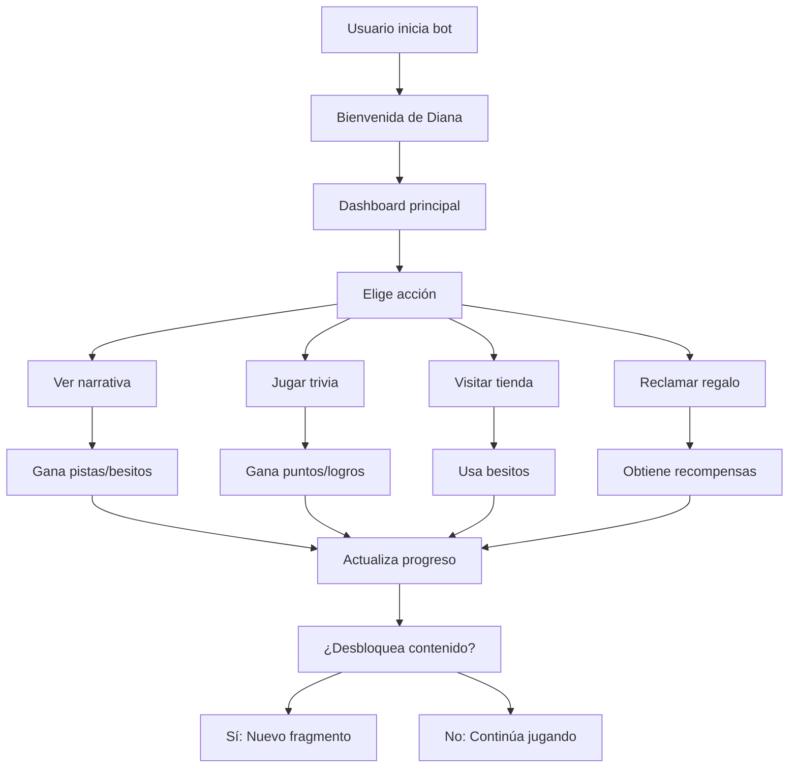

# 🌙 Introducción a Diana Bot V2

## ¿Qué es Diana Bot?

Diana Bot V2 es un bot de Telegram innovador que combina **narrativa interactiva** con **gamificación** para crear una experiencia única. No es solo un bot de comandos, sino un **ecosistema narrativo-gamificado** donde cada acción tiene consecuencias y recompensas.

## 🎭 Concepto Central: Diana

Diana es el personaje central del bot - una entidad misteriosa con estados emocionales dinámicos que evolucionan según tus interacciones. Tiene personalidades múltiples:

- **🔮 Enigmática** - Misteriosa y reservada
- **💭 Vulnerable** - Abierta y emocional  
- **🔥 Provocadora** - Atrevida y directa
- **🧠 Analítica** - Lógica y observadora
- **🤐 Silenciosa** - Contemplativa y reflexiva

## 🎮 Características Principales

### 📖 Sistema Narrativo
- Historia interactiva que evoluciona con tus decisiones
- Fragmentos narrativos que se desbloquean progresivamente
- Pistas y objetos que afectan el desarrollo de la historia
- Decisiones que cambian el curso de los eventos

### 🏆 Sistema de Gamificación
- **Besitos** - Moneda virtual para compras y recompensas
- **Misiones** - Objetivos diarios y especiales
- **Logros** - Reconocimientos por actividades específicas  
- **Niveles** - Progresión basada en actividad
- **Rachas** - Bonificaciones por constancia

### 🛒 Tienda Integrada
- **12 objetos únicos** organizados en 4 categorías
- Objetos que afectan la narrativa
- Items de diferentes rareza y efectos
- Compras con besitos ganados

### 🧠 Trivias Interactivas
- **4 niveles de dificultad** (Fácil, Medio, Difícil, Experto)
- Preguntas sobre la lore de Diana
- Recompensas progresivas
- Rankings de precisión

### 🎁 Recompensas Diarias
- **12 tipos de recompensas** diferentes
- Sistema de rachas consecutivas
- Multiplicadores por constancia
- Efectos especiales aleatorios

## 👥 Tipos de Usuario

### 🆓 Usuario Gratuito
- Acceso a funcionalidades básicas
- Limitaciones en ciertos contenidos
- Participación en trivias normales
- Recompensas estándar

### 💎 Usuario VIP
- Acceso completo a todos los sistemas
- Contenido narrativo exclusivo
- Trivias de alto nivel
- Bonificaciones especiales
- Objetos únicos en la tienda

### 🛡️ Administrador
- Panel de control completo
- Gestión de usuarios y canales
- Estadísticas y métricas
- Control de eventos especiales

## 🔄 Flujo de Interacción

## 🚀 Cómo Empezar

1. **Inicia el bot** - Envía `/start` para comenzar
2. **Conoce a Diana** - Recibe tu primer fragmento narrativo
3. **Explora el menú** - Usa `/menu` para ver todas las opciones
4. **Reclama tu regalo** - Obtén tus primeros besitos diarios
5. **Participa en trivias** - Gana puntos y desbloquea contenido
6. **Toma decisiones** - Influye en la historia de Diana

## 🎯 Filosofía del Ecosistema

Diana Bot **NO es una colección de módulos independientes**. Es un **ecosistema integrado** donde:

- Cada acción afecta múltiples sistemas
- La narrativa guía el deseo del usuario  
- La gamificación le da forma a la experiencia
- La administración hace todo sostenible

### Ejemplo de Integración
Al reaccionar a una publicación de Diana:
- ✅ **Narrativa**: Puede desbloquear una pista
- ✅ **Gamificación**: Otorga besitos automáticamente  
- ✅ **Administración**: Registra la participación

## 📱 Próximos Pasos

Continúa leyendo:
- [Comandos Disponibles](02-comandos.md) - Lista completa de comandos
- [Sistema de Gamificación](03-gamificacion.md) - Cómo ganar y usar besitos
- [Sistema Narrativo](04-narrativa.md) - La historia de Diana

---

¡Bienvenido al mundo de Diana! 🌙✨