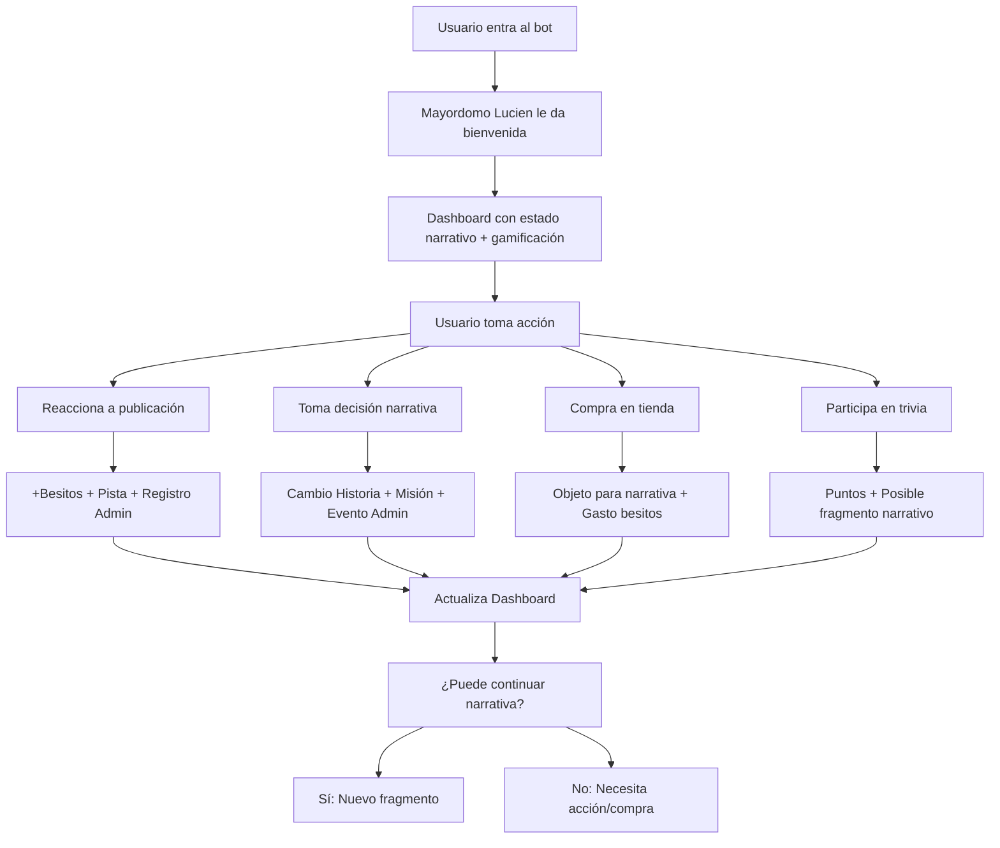

# 🔱 ANÁLISIS DEL ECOSISTEMA UNIFICADO - Diana Bot V2

## 🎯 Visión del Sistema Integrado

Basado en el documento `remp_narrativa/unificado.md`, Diana Bot **NO es un conjunto de módulos independientes**, sino un **ecosistema narrativo-gamificado** donde cada acción desencadena múltiples sistemas simultáneamente.

---

## 🧠 **NÚCLEO: EL USUARIO COMO EJE CENTRAL**

### 🔄 **Flujo Principal del Usuario:**


---

## 🔗 **INTERACCIONES CRÍTICAS IDENTIFICADAS**

### **📖 Narrativa → Gamificación → Administración**

| Acción del Usuario | Afecta Narrativa | Afecta Gamificación | Afecta Administración |
|-------------------|------------------|--------------------|--------------------|
| **Reacciona a publicación** | ✅ Puede desbloquear pista | ✅ Otorga besitos | ✅ Registra participación |
| **Toma decisión narrativa** | ✅ Cambia la historia | ✅ Puede activar misiones | 🔁 Se registra para eventos |
| **Compra en tienda** | 🔁 Objeto necesario para continuar | ✅ Gasta besitos | ❌ No impacta directamente |
| **Participa en trivia** | ✅ Puede otorgar fragmento oculto | ✅ Da puntos/badges | ❌ No impacta |
| **Accede a canal VIP** | ✅ Desbloquea niveles avanzados | ✅ Misiones especiales | ✅ Requiere suscripción |
| **Completa misión** | ✅ Puede otorgar fragmento | ✅ Gana besitos/logros | ❌ No impacta |

---

## 🎯 **PLAN DE IMPLEMENTACIÓN ESTRATÉGICO**

### **🚀 Fase 1: Base Fundamental (Usuario-Céntrico)**
**Objetivo:** Establecer el ritmo diário y la base del ecosistema

1. **🎁 Regalo Diario** 
   - ✅ Sistema completo implementado
   - 🔗 Establece hábito diario (esencial para narrativa serializada)
   - 🔗 Genera primeros besitos (motor de economía)
   - 🔗 Algunas recompensas pueden ser "pistas narrativas"

2. **📊 Dashboard de Progreso Integrado**
   - 🔗 Estado narrativo actual del usuario
   - 🔗 Besitos disponibles y gastos
   - 🔗 Misiones activas relacionadas con narrativa
   - 🔗 Progreso hacia próximo nivel narrativo

3. **👤 Perfil Unificado**
   - 🔗 Progreso narrativo + logros + besitos en una vista
   - 🔗 Objetos en mochila que afectan decisiones
   - 🔗 Estado VIP y acceso a niveles avanzados

### **🚀 Fase 2: Círculo de Engagement**
**Objetivo:** Crear el loop de acción-recompensa-progreso

4. **🧠 Trivias Narrativas**
   - 🔗 Preguntas relacionadas con la historia de Diana
   - 🔗 Recompensas incluyen pistas narrativas
   - 🔗 Algunas respuestas afectan decisiones futuras

5. **🎯 Misiones Conectadas**
   - 🔗 Misiones que requieren acciones narrativas
   - 🔗 Completar fragmentos desbloquea nuevas misiones
   - 🔗 Recompensas incluyen objetos para la narrativa

6. **🛒 Tienda Narrativa**
   - 🔗 Objetos necesarios para continuar historia
   - 🔗 Pistas que desbloquean fragmentos ocultos
   - 🔗 Items que cambian opciones de decisión

### **🚀 Fase 3: Narrativa Integrada**
**Objetivo:** Completar la experiencia narrativa inmersiva

7. **📖 Sistema de Pistas Conectado**
   - 🔗 Pistas obtenidas por logros/besitos
   - 🔗 Combinaciones de pistas desbloquean secretos
   - 🔗 Progreso narrativo basado en pistas

8. **🎒 Mochila de Objetos Narrativos**
   - 🔗 Items que afectan decisiones disponibles
   - 🔗 Objetos que cambian la percepción de Diana
   - 🔗 Combinaciones que abren caminos secretos

### **🚀 Fase 4: Administración Completa**
**Objetivo:** Control total del ecosistema

9. **🛡️ Panel Admin Unificado**
   - 🔗 Control de eventos narrativos
   - 🔗 Gestión de gamificación integrada
   - 🔗 Administración de canales conectada

10. **🎫 Tokens VIP Narrativos**
    - 🔗 Control de acceso a niveles avanzados
    - 🔗 Contenido VIP narrativo exclusivo
    - 🔗 Gestión automática de suscripciones

---

## 🎯 **PROPUESTA INMEDIATA: REGALO DIARIO**

### **¿Por qué empezar con Regalo Diario?**

✅ **Establece hábito diario** → Esencial para narrativa serializada  
✅ **Genera primeros besitos** → Motor de toda la economía  
✅ **Sistema 100% implementado** → Conexión inmediata posible  
✅ **Prepara terreno narrativo** → Algunas recompensas pueden ser pistas  
✅ **Base para engagement** → Usuario regresa diariamente  

### **🔧 Implementación Propuesta:**

1. **Conectar `daily_rewards_service` al menú épico**
2. **Mostrar estado actual del regalo**
3. **Mostrar racha consecutiva** (gamificación)
4. **Incluir "pistas narrativas" como recompensas especiales**
5. **Conectar con dashboard de progreso**

### **📝 Código de Conexión:**
```python
# En el menú épico - botón de regalo diario
async def handle_daily_gift(query: CallbackQuery):
    user_id = query.from_user.id
    
    # Verificar si puede reclamar
    can_claim = await daily_rewards_service.can_claim_daily_reward(user_id)
    
    if can_claim:
        # Reclamar regalo
        result = await daily_rewards_service.claim_daily_reward(user_id)
        
        if result["success"]:
            reward = result["reward"]
            consecutive_days = result["consecutive_days"]
            
            # Mostrar resultado con conexión narrativa
            text = f"""
🎁 **¡REGALO RECLAMADO!**

{reward.icon} **{reward.name}**
{reward.description}

🔥 **Racha actual:** {consecutive_days} días
⭐ **Efectos:** {result["effect"]["effects"]}

💭 *Diana sonríe: "La constancia es la clave de todos los secretos..."*
            """
            
            await query.message.edit_text(text)
        else:
            await query.answer(result["reason"])
    else:
        # Mostrar estado actual
        stats = await daily_rewards_service.get_user_daily_stats(user_id)
        # ... mostrar cuándo puede reclamar siguiente
```

---

## 🔱 **VISIÓN A LARGO PLAZO**

### **El Sistema Vivo:**
Diana Bot será un **ecosistema narrativo-gamificado** donde:

📖 **La narrativa guía el deseo**  
🎯 **La gamificación le da forma**  
🛡️ **La administración lo hace sostenible**  

### **Resultado Final:**
- **Cada acción** tiene consecuencias múltiples
- **Cada decisión** afecta el ecosistema completo  
- **Cada usuario** vive una experiencia única pero conectada
- **Cada día** trae nuevas posibilidades narrativas

---

## 🚀 **PRÓXIMO PASO INMEDIATO**

**Implementar Regalo Diario en el Menú Épico:**
1. Conectar el servicio ya implementado
2. Crear interfaz visual atractiva
3. Incluir conexiones narrativas sutiles
4. Preparar base para próximas integraciones

---

*Análisis generado: 2025-08-04*  
*Basado en: remp_narrativa/unificado.md + FUNCIONES_IMPLEMENTADAS_INVENTARIO.md*  
*Estado: ✅ Estrategia Definida - Lista para Implementación*
